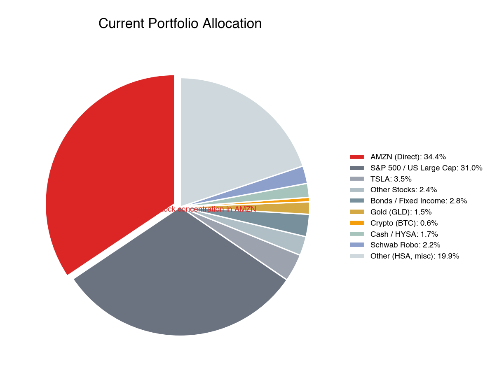
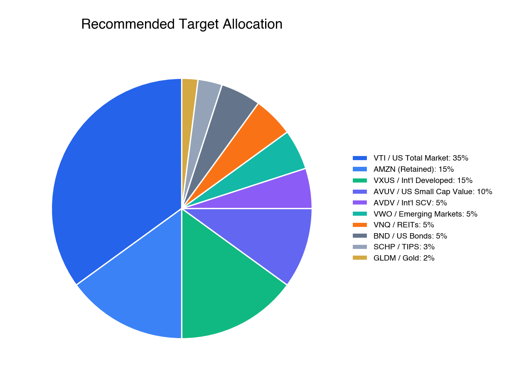
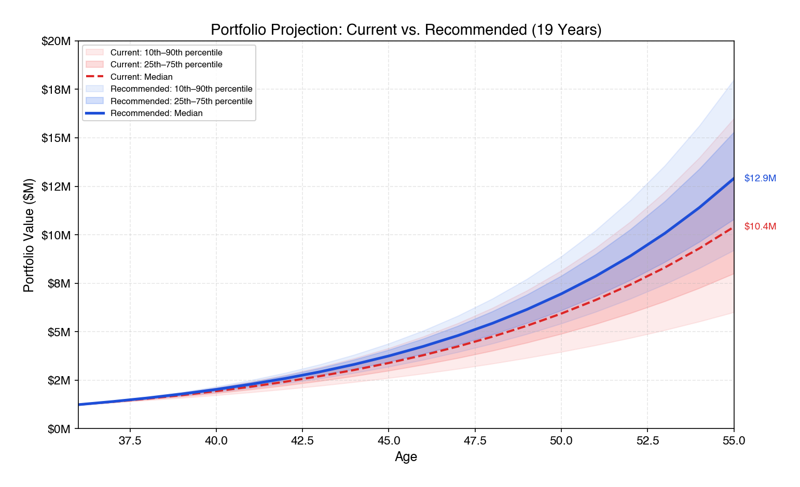
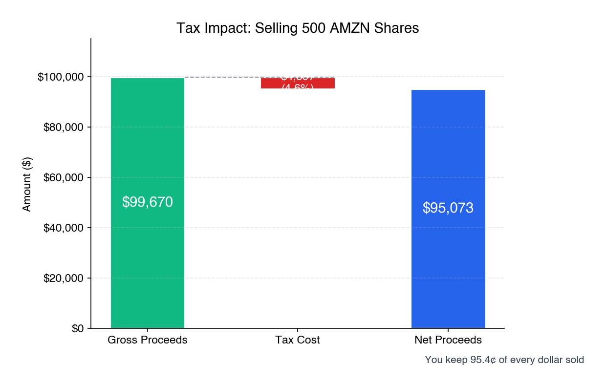
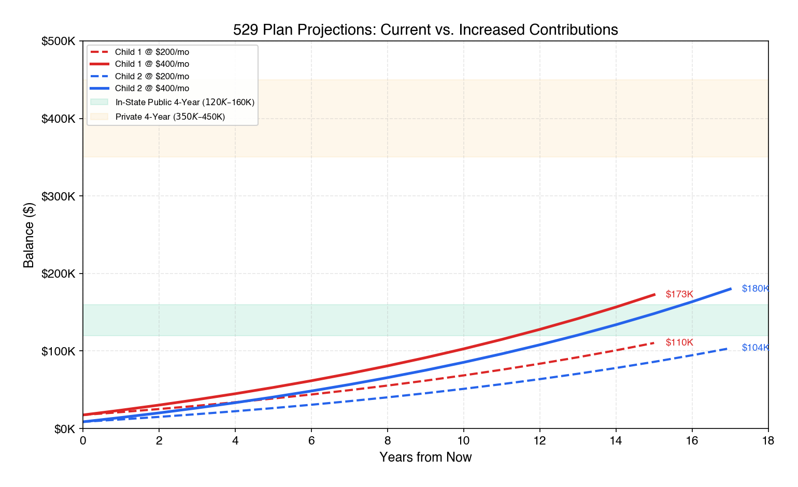

# Comprehensive Financial Plan — Cleary Family

**Date:** March 29, 2026
**Prepared by:** Fiduciary Advisory Board
**Client:** John Cleary (36) & Spouse (34)

---

> **CONFIDENTIAL** — This document contains sensitive financial information prepared exclusively for the Cleary family. It is not intended for distribution, reproduction, or use by any third party. All account numbers have been redacted. All projections are based on assumptions that may not reflect future results. This is fiduciary advice — we have no financial interest in any product recommended herein.

---

## 1. Executive Summary

You and your family are in an enviable financial position. At 36, with a combined household income approaching $400,000, a liquid investment portfolio of $1.25 million, a home with approximately $483,000 in equity, and $354,000 in unvested stock grants, your total net worth stands at approximately $2.09 million. Your savings rate is strong, your 401(k) is well-structured, and your 19-year runway to your target retirement at age 55 gives you the time to build substantial wealth.

But there is a structural flaw at the center of your finances that demands immediate attention: **51.2% of your total financial exposure — your stock, your unvested RSUs, your ESPP shares, and your salary — is tied to a single company.** Your vested Amazon shares total $431,000. Your unvested RSUs add another $354,000. Your paycheck comes from the same place. If Amazon stumbles — and history shows that even the best companies do — your portfolio, your future compensation, and your income could all decline simultaneously. This is not a theoretical risk. Amazon laid off 27,000 people in 2023 while its stock fell 50% from highs. Employees who held concentrated positions experienced a triple hit: portfolio losses, RSU impairment, and job insecurity at the same time.

The good news is that fixing this is straightforward, surprisingly affordable from a tax standpoint, and — based on our analysis — likely to leave you wealthier in the long run. Our Monte Carlo simulations show that a diversified portfolio produces a **median retirement balance of $12.9 million at age 55**, compared to $10.4 million for the current concentrated portfolio. You don't sacrifice returns by diversifying. You gain them — while cutting your worst-case scenarios dramatically.

### The Three Most Important Actions

1. **Top off your emergency fund.** You have approximately $21,848 in liquid cash ($20,000 in checking plus $1,848 in your E*Trade HYSA). This covers roughly one month of expenses — better than starting from zero, but still well below the $35,000–$40,000 target for a family of four with a $917,000 home loan. Redirect a portion of your next RSU vest proceeds to close the ~$13,000–$18,000 gap before doing anything else.

2. **Begin selling 500 shares of AMZN over the next 12 months.** The tax cost is only ~$4,597 — just 4.6% of the $99,670 in gross proceeds. Washington state has no income tax, so your effective long-term capital gains rate is just 18.8% (15% federal + 3.8% NIIT), and the gain per share is modest given your ~$157 average cost basis. Reinvest the proceeds into diversified international and total-market index funds.

3. **Open positions in VXUS (international stocks) and AVUV (small-cap value) with your next available dollars.** Your portfolio has essentially zero international exposure. This is the single largest gap in your allocation, and it leaves you entirely dependent on the continued outperformance of US large-cap stocks — a bet that has worked brilliantly for the last decade but is far from guaranteed for the next one.

### Retirement Feasibility Verdict

**Retirement at 55 is highly achievable.** Even in a below-average market scenario (25th percentile), you would accumulate $10.8 million by age 55, generating $36,000 per month under a 4% withdrawal rule. At the median, you reach $12.9 million — more than enough to maintain your current lifestyle indefinitely. The primary threat to this outcome is not market returns; it is concentration risk. Diversify, and the math works overwhelmingly in your favor.

---

## 2. Family Financial Profile

### Who You Are

John Cleary, age 36, is an L7 Senior Manager at Amazon, living in Seattle, Washington with his wife (34) and two young sons (ages 3 and 1). Married filing jointly. The family is in the accumulation phase of life — high earning years, growing expenses from young children, and a long but not unlimited runway to a target retirement date of age 55.

### Income Breakdown

Your total annual compensation is approximately $400,000, composed of two major streams:

| Component | Annual Amount | Notes |
|-----------|-------------|-------|
| Base salary | ~$229,500 | Cash, paid bi-weekly |
| RSU grants (vesting) | ~$170,500 | 856 shares vesting across 2026 at ~$199/share |
| **Total W-2 compensation** | **~$400,000** | Before taxes |

Amazon's RSU vesting schedule is back-loaded: 5% in Year 1, 15% in Year 2, 40% in Year 3, and 40% in Year 4. You currently hold two active grants totaling 1,776 unvested shares, with quarterly vesting events through February 2028. This structure means your compensation is heavily weighted toward Amazon stock — a point we will return to repeatedly throughout this plan.

Your ESPP participation adds additional Amazon exposure. You currently hold 220 ESPP shares acquired in August 2020 at $158.48 per share, now worth $43,855. You have a limit sell order set at $240.

### Current Savings Rate and Cash Flow

Your 401(k) contribution is $3,152 per month, which includes your employee contribution, employer match, and mega backdoor Roth contributions — an excellent use of the tax code. Based on your income and estimated living expenses in the high-cost Seattle market, your total annual savings — including 401(k), RSU retention, and taxable account contributions — appears to be approximately $190,000 per year, or roughly 47% of gross compensation. This is an exceptional savings rate that puts you well ahead of schedule for early retirement.

### Goals

Your stated financial goals, in priority order:

1. **Retire at age 55** with sufficient assets to maintain your current lifestyle
2. **Maintain your family's standard of living** through the accumulation years
3. **Fund your sons' college education** — 529 plans are already established
4. **Protect against catastrophic risk** — job loss, disability, premature death

### Risk Tolerance Assessment

Your current portfolio reveals a high tolerance for equity risk — you hold virtually no bonds and maintain a 35% single-stock position. However, your family situation (two young dependents, a large home loan, modest emergency reserves) suggests that your *capacity* for risk is lower than your *appetite* for it. Our recommendations balance your natural comfort with volatility against the reality that a severe drawdown in Amazon stock could simultaneously impair your portfolio, your compensation, and potentially your employment.

---

## 3. Current Portfolio — Where You Stand Today

### Account-by-Account Overview

You hold positions across ten accounts at four custodians. Here is the complete picture:

| Account | Type | Value | % of Total |
|---------|------|-------|------------|
| Bank Checking | Checking | $20,000 | 1.6% |
| E\*Trade HYSA | Savings (3.35% APY) | $1,848 | 0.1% |
| E\*Trade Brokerage | Individual Taxable | $250,639 | 20.0% |
| E\*Trade Roth IRA | Roth IRA | $102,649 | 8.2% |
| Schwab Traditional IRA | Traditional IRA | $17,122 | 1.4% |
| Schwab Robo-Advisor | Robo (Taxable) | $27,583 | 2.2% |
| Schwab Brokerage | Individual Taxable | $15,463 | 1.2% |
| Fidelity Individual TOD | Taxable Brokerage | $387,598 | 30.9% |
| Fidelity HSA | Health Savings Account | $31,528 | 2.5% |
| Fidelity 401(k) | 401(k) | $355,450 | 28.3% |
| Morgan Stanley ESPP | ESPP | $43,855 | 3.5% |
| **Total Liquid Assets** | | **$1,253,735** | **100%** |
| Amazon RSUs (unvested) | Restricted Stock | $354,028 | — |
| **Total Including Unvested** | | **$1,607,763** | — |

### Asset Allocation Analysis

Your current allocation tells a clear story: you are overwhelmingly invested in US large-cap equities, with dangerous single-stock concentration and virtually no international diversification.

| Asset Class | Value | % of Portfolio |
|-------------|-------|----------------|
| US Large Cap Equity | ~$820,000 | 66.5% |
| — of which AMZN (direct) | $431,453 | 35.0% |
| — of which AMZN (indirect via ETFs) | ~$27,000 | 2.2% |
| — of which TSLA | $43,420 | 3.5% |
| — of which other single stocks | ~$27,598 | 2.2% |
| International Equity | ~$7,576 | 0.6% |
| Emerging Markets | ~$3,789 | 0.3% |
| Small Cap | ~$4,606 | 0.4% |
| Gold | ~$19,103 | 1.5% |
| Crypto | ~$7,269 | 0.6% |
| Bonds / Fixed Income | ~$6,645 | 0.5% |
| REITs | ~$996 | 0.1% |
| Cash | ~$7,802 | 0.6% |

When you add the unvested RSUs, your total Amazon exposure — direct stock, indirect through ETFs, and unvested grants — reaches approximately **$812,000, or 51.2% of your total financial assets** (excluding your home). Add your Amazon salary, and the dependency is even more extreme.

### What's Working Well

Not everything needs fixing. Several aspects of your portfolio reflect sound financial instincts:

**Your 401(k) is excellent.** Ninety-six percent of it sits in the Vanguard Institutional 500 Index Trust at roughly 0.01% expense ratio. This is one of the cheapest equity vehicles available anywhere. Your contribution rate, including mega backdoor Roth, maximizes the tax advantages.

**Your Roth IRA placement of TSLA is brilliant** — whether by design or luck. You hold 120 shares of Tesla purchased at a cost basis that implies a 2,339% gain. In a taxable account, selling would trigger enormous capital gains taxes. In a Roth, every dollar of that $41,639 gain — and all future appreciation — is permanently tax-free. Never sell TSLA from the Roth.

**Your HSA is invested, not idle.** Many people leave their HSA in cash. You've deployed it into equity funds, taking advantage of the triple tax benefit (pre-tax in, tax-free growth, tax-free out for medical expenses). This is the single most tax-advantaged account in the US tax code, and you're using it correctly.

**Your ESPP shares are long-term holdings.** The 220 shares acquired in August 2020 at $158.48 qualify for long-term capital gains treatment, saving you thousands in taxes versus a disqualifying disposition.

### What Needs Fixing

**The Amazon concentration is the obvious problem**, and we will dedicate an entire section to it. But there are four other issues that need attention:

**You have essentially no international exposure.** Just 0.6% of your portfolio is invested outside the United States — roughly $7,600 across the small positions in the Schwab Robo account. The US represents about 60% of global market capitalization. You are making a massive implicit bet that US stocks will continue to outperform the rest of the world, despite trading at nearly double the valuation of international developed markets.

**Your emergency fund needs topping off.** With $20,000 in your checking account and $1,848 in your HYSA, your total liquid cash is approximately $21,848 — roughly one month of household expenses. For a family of four with a $917,000 private family loan, two young children, and a single primary earner, this is a meaningful start but still falls short of the recommended 3–6 month buffer ($35,000–$40,000). A job loss, medical event, or even a large home repair could still force you to sell investments at a bad time.

**Your accounts are sprawled across four custodians.** Ten accounts at E\*Trade, Schwab, Fidelity, and Morgan Stanley create unnecessary complexity. Rebalancing is difficult, tax-lot management is fragmented, and the cognitive overhead of monitoring everything works against disciplined portfolio management.

**Your fixed income allocation is almost nonexistent.** At 0.5% bonds, you have essentially zero downside cushion. While a low bond allocation is defensible at age 36 with a 19-year horizon, having *some* fixed income gives you rebalancing ammunition — the ability to buy equities cheaply during crashes by selling bonds that have held their value.

> **Bottom Line:** Your financial foundation is strong. Your savings rate is exceptional, your 401(k) structure is optimal, and your income trajectory is excellent. The portfolio's primary vulnerability is concentration — in Amazon specifically and in US large-cap equities generally. The recommendations that follow are designed to preserve what's working while systematically addressing what isn't.

---

## 4. The Macro-Economic Landscape & What It Means for Your Portfolio

We don't build portfolios in a vacuum. The decisions we're recommending — diversify away from Amazon, add international exposure, hold real assets like gold and TIPS — aren't just academic best practices. They're direct responses to the specific macro-economic environment you're investing in today. This section explains the forces shaping that environment and ties each one to a concrete portfolio action.

### The AI Capex Boom: Visionary Investment or Dot-Com Sequel?

You are living inside the most consequential technology investment cycle since the internet itself. In 2025 and 2026 alone, the major hyperscalers — Amazon, Microsoft, Google, and Meta — are collectively spending north of $500 billion on AI infrastructure: data centers, custom silicon, GPU clusters, and the power systems to run them. Amazon's share is staggering: $200 billion in planned 2026 capex, up 52% from $131.8 billion in 2025 and 37% above what Wall Street expected. This is the single largest capital expenditure program any company has ever undertaken outside of a nation-state.

The bull case is powerful and well-articulated. Artificial intelligence is a general-purpose technology — like electricity, the internal combustion engine, or the internet — that transforms not just one industry but all of them. AWS, with its $244 billion backlog, its custom Trainium chip architecture, and its partnerships with both Anthropic and OpenAI, sits at the center of this transformation. If AI delivers even a fraction of its promised productivity gains, the companies supplying the infrastructure will generate returns on the scale of the original cloud buildout. Amazon invested roughly $30–40 billion building AWS from 2006 to 2014 before it became profitable. AWS now generates $129 billion in annual revenue at 35% operating margins. The AI playbook could follow the same arc.

The bear case is equally compelling and historically grounded. Every transformative technology in history has produced a speculative investment cycle that ended in tears for investors who arrived late or overpaid. The railroad boom of the 1840s connected the world but bankrupted most of the railroad companies along the way. The dot-com bubble of 1999–2001 correctly identified the internet as revolutionary, then destroyed $5 trillion in market value when capital investment outran revenue reality. The crypto boom of 2021 produced genuine innovation in distributed computing — and also produced $2 trillion in losses when speculative fervor collided with tightening monetary policy.

The pattern is consistent: the technology is real, the adoption is real, and the losses are also real, because capital markets systematically overshoot during the buildout phase. The question is not whether AI will matter — it will — but whether $500+ billion in annual hyperscaler capex will generate adequate returns on the timeline the market is pricing in. Amazon's free cash flow went from $36.5 billion in 2023 to $7.7 billion in 2025 and is projected to go **negative** in 2026. The market, valuing Amazon at $199 per share, is pricing in the bull case almost exactly. If the AI payoff takes even one or two years longer than expected, the stock has significant downside.

This matters to you more than to almost any other investor. Your Amazon stock, your unvested RSUs, your ESPP shares, and your salary are all a leveraged bet on this single AI investment cycle paying off. If it does, you will be handsomely rewarded — your RSUs alone will deliver roughly $170,000 per year in vesting compensation. If it doesn't — or if it pays off eventually but the stock declines 30–40% during the waiting period, as happened in 2022 — you face simultaneous impairment of your portfolio, your expected compensation, and potentially your job security.

The key checkpoints are near: Q1 2026 earnings in late April will reveal whether AWS can sustain 24% growth. Q2 earnings in July will show the first full quarter of $200 billion capex impact. By Q4 2026, the market expects a "clear answer" on whether AI spending is generating commensurate revenue. If those checkpoints disappoint, AMZN could easily revisit $160 or below.

**What this means for your portfolio:** Diversification isn't a bet against Amazon or against AI. It is *insurance* against the possibility that even a correct thesis can produce a painful investment cycle. Selling 500 shares and deploying the proceeds into VTI and VXUS does not require you to be bearish. It requires you to acknowledge that you already have more Amazon exposure — through your stock, your RSUs, and your paycheck — than any prudent financial plan would recommend.

### The Changing World Order: Dalio's Framework and Your Dollars

Ray Dalio's *Principles for Dealing with the Changing World Order*, published in 2021 and updated through his ongoing research at Bridgewater Associates, presents a framework for understanding the rise and fall of reserve currencies and dominant empires over 500 years of history. His core argument is simple and uncomfortable: the United States exhibits most of the markers of a late-stage empire entering the declining phase of what he calls the "Big Cycle."

The indicators he tracks are not abstract. US national debt has surpassed $36 trillion, with debt-to-GDP approaching 130% — a level that historically precedes either aggressive monetary intervention (money printing) or painful austerity. Neither outcome is good for holders of dollar-denominated assets. The Congressional Budget Office projects annual federal deficits exceeding $2 trillion through the end of the decade, with interest payments on the national debt now exceeding defense spending. This isn't a partisan observation — it is bipartisan fiscal reality.

Simultaneously, the dollar's monopoly as the world's reserve currency faces its first serious challenge in decades. China's digital yuan, the BRICS nations' exploration of alternative settlement systems, and the increasing willingness of major commodity exporters to accept non-dollar payment all chip away at the structural demand that has allowed the US to run persistent deficits without consequence. Dalio argues that this erosion happens gradually, then suddenly — and that the "suddenly" phase is often accompanied by inflation, currency debasement, and a repricing of financial assets.

None of this means the US is about to collapse. The US still has the world's deepest capital markets, strongest rule of law, most innovative technology sector, and most powerful military. But Dalio's framework doesn't predict collapse — it predicts *relative decline*, a shifting of economic gravity that plays out over decades. And for a 36-year-old building a portfolio meant to last 50+ years, decades are exactly the relevant timeframe.

**What this means for your portfolio:** Your current allocation is 99.4% US-based. If Dalio is even partially correct — if the next two decades see a gradual rebalancing of global economic power — then holding essentially zero international exposure is not just an oversight, it is a material risk. The recommended 25% allocation to international equities (VXUS, AVDV, VWO) isn't speculative; it's a reflection of the US representing roughly 60% of global market capitalization and a hedge against the possibility that international stocks, currently trading at roughly half the valuation of US stocks (CAPE of 18x vs. 35x), outperform over your accumulation horizon.

The 2% gold allocation (GLDM) maps directly to Dalio's thesis as well. Gold is the asset that has preserved purchasing power through every currency debasement in recorded history. It does not generate cash flow, which makes it a poor holding in isolation — but as a portfolio hedge against dollar weakness and inflation, it has earned its place. Your current GLD position (~$19,000) already reflects this instinct; we simply recommend transitioning to GLDM for the lower expense ratio (0.10% vs. 0.40%) and maintaining it at 2% of the portfolio going forward.

The 3% TIPS allocation (SCHP) provides a different kind of protection. Treasury Inflation-Protected Securities adjust their principal upward with CPI, providing a guaranteed real return. In a scenario where the Federal Reserve is forced to monetize debt — effectively printing money to service government obligations — TIPS protect your purchasing power in a way that nominal bonds cannot. Current TIPS real yields of 2.0–2.2% are historically attractive, making this an opportune time to establish the position.

### Interest Rates, Inflation, and the Federal Reserve

The current interest rate environment is defined by uncertainty. The Federal Reserve raised rates aggressively from near-zero in 2022 to over 5% in 2023, then began cutting in late 2024. As of early 2026, the federal funds rate sits in a range that reflects the Fed's attempt to balance still-sticky inflation against slowing economic growth. The forward curve suggests modest additional cuts over the next 12–18 months, but the path is far from certain.

For your portfolio, the rate environment has several direct implications.

**Your 3% family loan is a financial superpower.** In a world where mortgage rates for new borrowers are in the 6–7% range, your 3% rate on a $917,000 private family loan is an extraordinary asset. You are borrowing at a rate *below* expected inflation, which means your loan balance is effectively being eroded in real terms every year. Every dollar you pay toward this loan is worth less in purchasing power than the dollar you borrowed. Do not accelerate payoff. This rate is a gift that subsidizes your wealth accumulation.

**Rate cuts favor growth stocks; rate hikes favor value.** If the Fed continues cutting, growth stocks (including Amazon) tend to benefit from lower discount rates on their future cash flows. If inflation reignites and forces rate hikes, value stocks and international equities — which trade at lower valuations and are less duration-sensitive — tend to outperform. Your current portfolio is a pure bet on the growth/rate-cut scenario. Adding value exposure through AVUV and AVDV, and international exposure through VXUS and VWO, provides balance across both outcomes.

**Bond allocation timing is favorable.** With real yields on TIPS at 2%+ and nominal yields on aggregate bonds above 4%, the fixed-income component of your portfolio can now generate meaningful income for the first time in years. The recommended 8% bond allocation (5% BND + 3% SCHP) provides both rebalancing ammunition for the next equity drawdown and a base level of inflation protection.

### Geopolitical Risk: Why Geographic Diversification Has Never Mattered More

The US-China relationship has entered a structural adversarial phase that transcends any single administration. Trade restrictions on semiconductor exports, tariffs on Chinese goods, the CHIPS Act subsidizing domestic semiconductor manufacturing, and the persistent threat of a Taiwan conflict all point toward long-term economic decoupling between the world's two largest economies.

For Amazon specifically, geopolitical risk is real and multifaceted. AWS operates data centers globally and is a strategic national asset in the context of information security and cloud computing. The launch of Amazon Haul — a direct-from-China budget shopping platform — creates supply chain exposure to trade policy escalation. More broadly, any conflict involving Taiwan would disrupt the semiconductor supply chain on which Amazon's AI infrastructure depends.

For your portfolio, the lesson is straightforward: geographic diversification of your investments reduces exposure to US-specific policy, regulatory, and geopolitical risk. The recommended 25% international allocation doesn't require a bearish view on the United States. It simply acknowledges that a globally diversified portfolio is more resilient to shocks that affect any single country — including shocks that are difficult to predict.

### Tying It Together: Macro Risks and Portfolio Responses

Each macro theme maps to a specific portfolio recommendation. This isn't abstract — it's the bridge between global forces and your next dollar invested.

| Macro Risk | Portfolio Response | Specific Action |
|------------|-------------------|-----------------|
| AI boom/bust cycle | Reduce AMZN concentration | Sell 500 shares → buy VTI and VXUS |
| US economic decline / Dalio thesis | International diversification | 25% allocation to VXUS, AVDV, VWO |
| Inflation / debt monetization | Real asset exposure | 2% GLDM + 3% SCHP + 5% VNQ |
| Dollar debasement | Non-dollar assets | International stocks provide implicit FX diversification |
| Interest rate uncertainty | Balanced factor exposure | Add value tilt (AVUV/AVDV) alongside growth |
| US-China decoupling | Supply chain diversification | Broad international + EM exposure (VWO) |
| Recession / consumer pullback | Defensive positioning | 8% bonds + $35K emergency fund |

The thread that connects every row of this table is the same: **diversification is not a sacrifice of returns. It is a purchase of resilience.** Our Monte Carlo analysis confirms this empirically — the diversified portfolio produces higher median returns AND better worst-case outcomes than the concentrated portfolio. You gain on both dimensions. The macro environment makes this case even stronger.

> **Bottom Line:** The macro backdrop — AI capex uncertainty, US fiscal imbalances, Dalio's Big Cycle indicators, and intensifying geopolitical competition — does not call for panic. It calls for prudence. You are not diversifying because the sky is falling. You are diversifying because the sky has been unusually clear for US large-cap investors for the past decade, and prudent people carry an umbrella even when the sun is shining.

---

## 5. Amazon Concentration — The Central Risk

### The Triple Correlation Problem

The most important thing to understand about your Amazon exposure is that it is not simply a large stock position. It is a *correlated system* — a web of financial dependencies that all move together in the worst possible way during a downturn.

**Stock risk:** Your 2,164 vested shares (1,944 in Fidelity TOD plus 220 ESPP shares) are worth $431,453 at today's price. A 30% decline — well within Amazon's historical range — would cost you $129,000.

**RSU risk:** Your 1,776 unvested shares are worth $354,028. These are not optional — they vest on a fixed schedule and their value is entirely determined by AMZN's stock price. A 30% decline doesn't just hurt your portfolio; it reduces your expected compensation by over $100,000.

**Employment risk:** Your base salary of $229,500 comes from Amazon. In a scenario where Amazon's business deteriorates enough to cause a major stock decline, the probability of layoffs increases simultaneously. Amazon eliminated 27,000 positions in 2023. The 5-day return-to-office mandate in 2025 was designed in part to drive voluntary attrition. The scenario where your stock drops, your RSUs lose value, AND your job is at risk is not a theoretical tail event — it happened to thousands of Amazon employees in late 2022 and early 2023.

**Indirect exposure adds to the problem.** Your SPY, QQQ, and FXAIX holdings contain Amazon at approximately 3–6% weighting. Your $578,000 in S&P 500 index funds includes roughly $20,000–$27,000 of additional AMZN exposure. When you include this indirect exposure, your total Amazon-linked assets approach $812,000, or 51.2% of your total financial picture including unvested RSUs.

### Quantifying the Downside

The following table shows what happens to your total Amazon exposure under various decline scenarios:

| Scenario | Stock Price | Vested Loss | Unvested Loss | Total Loss |
|----------|-----------|-------------|---------------|------------|
| 10% correction | $179 | -$43,100 | -$35,400 | -$78,500 |
| 20% correction | $159 | -$86,300 | -$70,800 | -$157,100 |
| 30% bear market | $140 | -$129,400 | -$106,200 | -$235,600 |
| 40% crash (2022-type) | $120 | -$172,500 | -$141,600 | -$314,100 |
| 50% severe bear | $100 | -$215,700 | -$177,000 | -$392,700 |

A repeat of the 2022 drawdown would cost you approximately $314,000 in combined vested and unvested value — plus the stress of potential job insecurity during a period when you have two children under age 4 and only ~$21,848 in liquid cash reserves. This is not a risk profile that any fiduciary advisor can endorse.

### The Bull Thesis — Acknowledged

We are not dismissing your conviction on Amazon. The bull case has substance:

**AWS is a generational franchise.** $244 billion in committed backlog, 24% revenue growth, 35.4% operating margins, and a custom silicon roadmap (Trainium2/3) that could give Amazon a structural cost advantage in AI compute. AWS alone is worth $1 trillion or more on a standalone basis.

**Advertising is a stealth profit engine.** Amazon's $68 billion advertising business operates at near-100% incremental margins, leveraging existing traffic and purchase-intent data. This is the third-largest digital ad platform in the world and still growing 22% annually.

**Logistics scale is nearly irreplicable.** Over 1 million robots, 8 regionalized fulfillment zones, and same-day delivery leadership create a moat that would cost tens of billions of dollars and a decade to replicate.

**The $200 billion AI capex bet could pay off spectacularly.** If Amazon's investment cycle follows the same trajectory as the original AWS buildout — heavy losses for 5–7 years followed by dominant market position and outsized margins — the stock could be worth $300+ by 2030.

We are not asking you to be bearish on Amazon. We are asking you to recognize that even if every element of the bull thesis plays out, the risk of holding 51% of your financial life in a single company is uncompensated. The market doesn't pay you extra for taking concentrated risk. It pays you extra for taking *diversified* risk. By selling some AMZN and buying VTI and VXUS, you are not betting against Amazon. You are buying the entire global economy — which includes Amazon.

### Q4 2026: The Critical AI Checkpoint

The next twelve months will likely determine the near-term narrative around Amazon's AI investment. The market wants to see:

- AWS revenue growth sustaining above 20% through at least Q2 2026
- Trainium3 deployment on schedule with competitive performance benchmarks
- Operating income guidance above $88 billion for full-year 2026
- Early signs of AI-driven FCF recovery by Q4 2026

If these checkpoints are met, the stock likely trades to $230–$250 and your remaining shares (after selling 500) will appreciate meaningfully. If they are missed — particularly if AWS growth decelerates below 18% or capex guidance increases further — the stock could revisit $160–$170, and the case for continuing to hold a large position weakens considerably.

> **Bottom Line:** Amazon may well be a great long-term investment. But your exposure to it is not an investment decision — it is a *life concentration* decision. Your stock, your income, your future compensation, and your career stability all depend on the same company. No single company, however excellent, should occupy that role in your financial life. Reduce the vested position to 15–20% of your liquid portfolio over the next 12–18 months, and let the ongoing RSU grants provide your continuing Amazon exposure.

---

## 6. Investment Strategy — The Path Forward

### Target Allocation: 85% Equity / 8% Bonds / 7% Alternatives

The recommended portfolio is designed for an aggressive growth investor with a 19-year horizon, high income, and the emotional tolerance for equity volatility — but with proper diversification across geographies, market capitalizations, and factors.

| Asset Class | Target % | Current % | Target $ | Change Needed |
|-------------|----------|-----------|----------|---------------|
| US Total Market (ex-AMZN) | 35% | 47% | $431,800 | -$148,100 |
| AMZN (retained) | 15% | 35% | $185,100 | -$246,400 |
| International Developed | 15% | 0.6% | $185,100 | +$177,500 |
| US Small Cap Value | 10% | 0.4% | $123,400 | +$118,500 |
| Int'l Small Cap Value | 5% | ~0% | $61,700 | +$61,100 |
| Emerging Markets | 5% | 0.3% | $61,700 | +$57,900 |
| REITs | 5% | 0.1% | $61,700 | +$60,700 |
| US Aggregate Bonds | 5% | 0.5% | $61,700 | +$55,100 |
| TIPS | 3% | ~0% | $37,000 | +$36,500 |
| Gold | 2% | 1.5% | $24,700 | +$5,600 |

### Why This Allocation

**85% equity is appropriate for your situation.** The classical "120 minus age" heuristic suggests 84% equities at age 36 — we are right on target. Your high income ($400K) acts as a bond-like human capital asset, generating large ongoing contributions that reduce your dependence on portfolio returns in the near term. Your 19-year horizon is long enough to recover from even the worst historical drawdowns (the 2008 recovery took about 5.5 years from trough).

**35% US total market + 15% AMZN = 50% US large cap.** This gives you broad US exposure through VTI while allowing you to retain a meaningful Amazon position that reflects your conviction. The 15% AMZN cap is above our normal 5% single-stock recommendation, but it's a pragmatic compromise that reduces your concentration by more than half while keeping you invested in a company you know deeply.

**25% international corrects the most critical gap.** You currently have 0.6% international exposure. The US represents approximately 60% of global market capitalization. International developed markets (Europe, Japan, Australia) currently trade at a CAPE ratio of roughly 18x versus 35x for the US. Emerging markets trade at roughly 13x. Over rolling 10-year periods, international stocks have outperformed US stocks approximately 40% of the time. The last time the US-international valuation gap was this wide — in the early 2000s — international stocks outperformed US stocks for the following decade.

**15% factor tilt toward small-cap value captures a historically persistent premium.** The Fama-French size and value factors have delivered a combined premium of 3–5% annually over US large-cap growth across the full historical dataset going back to 1926. AVUV (US small-cap value) and AVDV (international small-cap value) use Avantis's systematic, profitability-screened methodology that has outperformed traditional SCV indices by approximately 4–5% annually since inception. This tilt adds expected return at the cost of higher volatility — which is exactly why we place these holdings in the Roth IRA and HSA, where gains are never taxed.

**8% bonds provides rebalancing ammunition.** This allocation isn't about income generation. It's about having dry powder during equity drawdowns. When stocks fall 30%, you sell bonds that have held their value and buy equities at a discount. This mechanical rebalancing — selling high, buying low — has historically added 0.3–0.5% in annual returns. The split between BND (nominal bonds) and SCHP (TIPS) gives you both interest rate duration and inflation protection.

**7% alternatives (REITs + gold) adds non-correlated return streams.** REITs provide diversified real estate exposure and inflation protection through rent escalation. Gold provides a hedge against currency debasement and tail-risk scenarios. Neither is expected to drive portfolio returns, but both reduce overall portfolio volatility through low correlation with equities.

### Specific ETF Recommendations

| Asset Class | ETF | Expense Ratio | Why This Fund |
|-------------|-----|---------------|---------------|
| US Total Market | **VTI** | 0.03% | 4,000+ stocks; broader than SPY; superior tax efficiency |
| US Small Cap Value | **AVUV** | 0.25% | Best-in-class SCV with profitability screen; +4%/yr vs. VTI since inception |
| International Developed | **VXUS** | 0.05% | 8,500+ international stocks; qualifies for Foreign Tax Credit |
| Int'l Small Cap Value | **AVDV** | 0.36% | Factor premium in less-efficient international markets |
| Emerging Markets | **VWO** | 0.08% | Broadest EM coverage at lowest cost |
| US Aggregate Bonds | **BND** | 0.03% | 11,000+ bonds; core fixed income |
| TIPS | **SCHP** | 0.05% | Cheapest TIPS ETF available |
| REITs | **VNQ** | 0.12% | 160+ US REITs; diversified real estate |
| Gold | **GLDM** | 0.10% | Same gold exposure as GLD at 75% lower cost |

The portfolio-weighted expense ratio comes to approximately **0.08% annually** — less than one-tenth of what a typical financial advisor charges, before even counting their fund fees. On a $1.2 million portfolio, that's roughly $960 per year in total costs.

### Asset Location Optimization

Where you hold each fund matters almost as much as what you hold. Proper asset location — placing tax-inefficient assets in tax-advantaged accounts and tax-efficient assets in taxable accounts — can add 0.3–0.5% per year in after-tax returns.

**Roth IRA ($102,649) — Tax-Free Growth Forever:** AVUV and AVDV belong here. These small-cap value funds have the highest expected returns and highest turnover in the portfolio. Every dollar of gain in the Roth is permanently tax-free. Keep TSLA here as well — the $41,639 in unrealized gains will never be taxed. Over time, phase out SPY and QQQ in favor of AVUV and AVDV as new contributions flow in.

**HSA ($31,528) — Triple-Tax-Advantaged:** 100% AVUV. The HSA is the single best account in the US tax code — pre-tax contributions, tax-free growth, tax-free withdrawals for medical expenses. Put your highest-growth asset here and don't touch it until retirement. Transition away from the current SPY/QQQ/FXAIX holdings over time.

**Traditional IRA ($17,122) — Tax-Deferred:** BND and SCHP. Bond income is taxed as ordinary income — in a tax-deferred account, you defer that tax. TIPS generate "phantom income" from inflation adjustments that is taxable even though you haven't received the cash — keeping them in the IRA avoids this problem entirely.

**401(k) ($355,450) — Tax-Deferred, Limited Options:** Keep the Vanguard Institutional 500 Index Trust as the core (it's one of the cheapest equity vehicles in existence). Phase out the SSGA Large Cap Growth and Value funds (~$13,500) — they are redundant with the 500 index at higher expense ratios. If Amazon's plan offers BrokerageLink, use it to add VNQ for REIT exposure.

**Taxable Accounts ($681,537) — E\*Trade, Schwab, Fidelity:** AMZN stays here (don't trigger gains by transferring). VTI and VXUS are the primary holdings — both are extremely tax-efficient due to low turnover and qualified dividends. VXUS in taxable also lets you claim the Foreign Tax Credit on Form 1116, recovering taxes withheld by foreign governments. GLDM and VWO round out the allocation.

### The Core-Satellite Approach: 90% Index, 10% Individual Stocks

We recommend a 90/10 split between passive index funds and individual stock positions. The 90% core provides diversified, low-cost market exposure. The 10% satellite — primarily your retained AMZN position and the TSLA in your Roth — satisfies the natural desire to own companies you understand and believe in.

The academic evidence overwhelmingly favors index investing for non-professional investors. Single-stock risk is uncompensated — you take more risk for the same expected return. Tax management is simpler with ETFs. And your time is more productively spent at your $400,000-per-year job than researching individual stocks.

**Hard limit: AMZN should never exceed 20% of your liquid portfolio.** If appreciation pushes it above 20%, sell to rebalance. The ongoing RSU grants will continuously add new AMZN exposure — there is never a shortage of Amazon in your portfolio.

### Monte Carlo Projections: Diversified vs. Concentrated

We ran 10,000 Monte Carlo simulations for each portfolio scenario over your 19-year accumulation period, assuming $190,124 in annual contributions.

| Percentile | Current (Concentrated) | **Recommended (Diversified)** | Difference |
|------------|----------------------|------------------------------|------------|
| 10th (bad luck) | $6.0M | **$9.2M** | +$3.2M |
| 25th (below average) | $7.7M | **$10.8M** | +$3.1M |
| **50th (median)** | **$10.4M** | **$12.9M** | **+$2.4M** |
| 75th (above average) | $14.0M | **$15.3M** | +$1.3M |
| 90th (great luck) | $18.5M | **$18.0M** | -$0.5M |

The results are unambiguous. The diversified portfolio outperforms the concentrated portfolio at every percentile except the 90th — and even there, the difference is just $500,000 on a $18 million base. Where diversification truly shines is in the downside scenarios: the 10th percentile outcome improves by $3.2 million. In the bad-luck world, diversification is the difference between $6 million (comfortable but tight) and $9.2 million (wealthy).

The concentrated portfolio's Sharpe ratio is 0.18 — terrible risk-adjusted performance driven by the single-stock volatility. The diversified portfolio's Sharpe ratio is 0.42 — more than double the efficiency. You are not giving up returns to diversify. You are *gaining* returns while *reducing* risk. This is the only free lunch in investing.

### Account Consolidation

We recommend simplifying from 10 accounts at 4 custodians to 5 accounts at 3 custodians:

| Account | Action | Rationale |
|---------|--------|-----------|
| E\*Trade Brokerage | **Keep — primary taxable** | Largest taxable account |
| E\*Trade Roth IRA | **Keep — primary Roth** | Transition to AVUV/AVDV |
| Schwab Traditional IRA | **Keep — bonds only** | Specialized purpose |
| Schwab Robo ($27.5K) | Liquidate → E\*Trade | Duplicative; well-diversified but redundant |
| Schwab Brokerage ($15.5K) | Liquidate → E\*Trade | Simplify |
| Fidelity TOD ($387.6K) | **Keep — AMZN stays here** | Don't trigger gains by transferring |
| Fidelity HSA | **Keep — transition to AVUV** | Employer-linked, can't move easily |
| Fidelity 401(k) | **Keep** | Employer plan, no choice |
| Morgan Stanley ESPP | **Sell → reinvest** | Reduce concentration |
| E\*Trade HYSA | Keep or build as emergency fund | Needs to grow to $35K+ |

> **Bottom Line:** The path from where you are to where you should be is clear: sell AMZN gradually, buy VXUS and AVUV aggressively, consolidate accounts, and place each asset in the most tax-efficient account. The math shows this produces more wealth with less risk. The macro environment makes it urgent. The tax cost is minimal. The only obstacle is behavioral inertia — and this plan is designed to make action as simple as possible.

---

## 7. Tax Strategy — Smarter Than You Think

### Why Selling AMZN Is Cheaper Than You Expect

Many people with large stock positions assume that selling will trigger a devastating tax bill. In your case, that assumption is wrong — and understanding why is the key to unlocking the diversification strategy.

Your average cost basis across all vested AMZN shares is approximately $157 per share. At a current price of $199.34, your embedded gain is only about $42 per share — a 27% gain, not the 200%+ gain that some early tech employees face. The reason is straightforward: RSU shares vest at market price, so the vesting price becomes your cost basis. Since Amazon hasn't had a parabolic run from your vesting dates, your gains are modest.

### Your Tax Rate on Capital Gains

As a married couple filing jointly with approximately $400,000 in total W-2 income, living in Washington state (which has no state income tax), your capital gains tax rate stacks as follows:

| Tax Component | Rate |
|---------------|------|
| Federal long-term capital gains | 15.0% |
| Net Investment Income Tax (NIIT) | 3.8% |
| Washington state income tax | 0.0% |
| **Combined effective rate on LTCG** | **18.8%** |

Washington does impose a 7% capital gains tax on gains exceeding $270,000 per year, but this threshold is unlikely to be triggered in the recommended 500-share selling scenario (~$24,454 in gains). If you sell larger amounts in a single tax year and exceed the $270,000 threshold, factor in the additional 7% on the excess.

This rate applies to the *gain*, not the proceeds. Since your gain is only $42 per share on a $199 stock, the effective tax rate on gross proceeds is just 3.9%.

### Selling Scenario Comparison

| Metric | Status Quo | Sell 500 Shares | Sell 1,000 Shares |
|--------|-----------|-----------------|-------------------|
| Shares sold | 0 | 500 | 1,000 (split across 2 tax years) |
| Gross proceeds | $0 | $99,670 | $199,340 |
| Capital gains realized | $0 | $24,454 | $48,907 |
| **Total tax on gains** | **$0** | **~$4,597** | **~$9,195** |
| Tax as % of proceeds | — | 4.6% | 4.6% |
| Net proceeds after tax | $0 | ~$95,073 | ~$190,145 |
| Remaining vested AMZN | 2,164 | 1,664 | 1,164 |
| AMZN % of portfolio | ~35% | ~27% | ~19% |

*Tax breakdown for 500-share sale: Federal LTCG (15%) = $3,668 + NIIT (3.8%) = $929 + WA capital gains tax = $0 (gain under $270K threshold). For the 1,000-share sale split across two years: Year 1 (667 shares) gain ~$32,621 → tax ~$6,133; Year 2 (333 shares) gain ~$16,286 → tax ~$3,062.*

The tax bill on selling 500 shares is $4,597. That is less than a single quarterly RSU vest. You keep 95.4 cents of every dollar you sell. This is the factual starting point for everything else in this section.

### Tax-Loss Harvesting: Limited Opportunities

Unfortunately, your portfolio is almost universally profitable. The only meaningful unrealized loss is a $271 loss on BTC in the Roth IRA, which cannot be used for tax purposes. Nearly every other position carries gains of 30–80% or more. This means capital gains from AMZN sales cannot be offset by harvesting losses elsewhere. That said, if AMZN declines during your selling period, accelerating sales during dips would reduce the taxable gain per share.

### Exchange Funds: Why They're Not the Right Fit

Exchange funds — private partnerships that allow you to contribute concentrated stock and receive a diversified interest without triggering a taxable event — are an elegant tool for the right situation. Your situation is not the right one. Here is why.

An exchange fund works by deferring the capital gains tax that would otherwise be owed on the sale of appreciated shares. The tax savings compound over a mandatory 7-year lock-up period. For investors with massive embedded gains — imagine someone who bought Amazon at $5 per share — the deferred tax can be hundreds of thousands of dollars, making the 7-year illiquidity and fund fees a worthwhile trade.

Your embedded gain is approximately $42 per share. On a $400,000 position, the total deferred tax would be approximately $27,600. Against this, Cache — the only accessible provider given that you don't meet the $5 million Qualified Purchaser threshold required by Morgan Stanley, Goldman Sachs, and Fidelity — charges an estimated 0.85% annually, or roughly $29,400 over the 7-year lock-up period. After accounting for the compounding benefit of deferral (~$16,700), the net economic advantage of the exchange fund is approximately $15,000 — about $2,100 per year. That is a modest benefit in exchange for locking up $400,000 for seven years, adding significant complexity, and accepting the risk that your life circumstances change in ways that make the illiquidity painful.

For someone with a near-zero cost basis, exchange funds are compelling. For someone with a $157 basis on a $199 stock, they are a solution in search of a problem. Sell directly.

### The Mark Cuban Collar: Why It Doesn't Apply to You

You asked about hedging your AMZN position the way Mark Cuban hedged his Yahoo position — using a costless collar (buying protective puts financed by selling covered calls). It's a smart question that deserves a thorough answer.

**What Cuban did and why it worked for him:** In 1999, Cuban received 14.6 million shares of Yahoo from the Broadcast.com acquisition. He couldn't sell due to a lockup period, had a near-zero cost basis (making selling prohibitively expensive even without the lockup), and faced $1.4 billion in single-stock risk. He bought puts at $85 and sold calls at $205 for zero net cost. When Yahoo crashed 97% during the dot-com bust, the $85 put floor saved him over $1 billion.

**Why it doesn't work for you:** Cuban used a collar because he *had no choice* — he was locked up and couldn't sell. You can sell freely. Cuban's embedded gain was essentially 100% of the stock price. Yours is 21%. Cuban's tax cost for selling would have been hundreds of millions of dollars. Yours is $4,597 per 500 shares.

The best available collar for your position — a 12-month $180 put / $240 call, costless — would protect you below $180 (10% downside) and cap your upside at $240 (20% upside). This structure has a 33% spread, safely above the constructive sale threshold. But it comes with real complications:

- **Amazon insider policy requires Legal preclearance.** As a Senior Manager with visibility into network infrastructure decisions and potential access to material non-public information (MNPI) during certain periods, your trading restrictions may be more stringent than those of individual contributors. Verify your specific trading window and preclearance requirements with Amazon Legal before executing any options strategy.
- **If AMZN rallies past $240**, your shares are called away at $240 and you owe *more* tax ($49,000 on a $83/share gain) than if you'd simply sold at $199 ($25,000 on a $42/share gain).
- **If AMZN stays flat**, the collar expires and you've spent 12 months managing an options position that accomplished nothing.
- **Rolling costs** of $500–$1,400 per year add up over multi-year holding periods.

A collar starts making financial sense when your embedded gain exceeds roughly 50–60% of the share price. At your 21% gain level, the complexity-to-benefit ratio is unfavorable. The collar is a scalpel designed for a situation that calls for a butter knife.

### ESPP Strategy

Your limit sell at $240 is reasonable. If Amazon reaches $240, the 220 ESPP shares would generate $52,800 in gross proceeds with approximately $8,990 in long-term capital gains (tax: ~$1,690 at 18.8%). The net proceeds of ~$50,300 go straight into your diversification program. If $240 seems unlikely in the near term, consider selling at market ($199) — the $8,990 gain still qualifies for long-term treatment, and the proceeds can be put to work immediately in diversified funds.

> **Our Recommendation:** Execute Scenario 2 — sell 500 shares over 12 months (~42 shares per month during open trading windows). Skip the collar. Skip the exchange fund. The tax cost of ~$4,597 is less than you spend on childcare in a month. It buys you ~$95,073 in diversified capital and a meaningful reduction in concentration risk. Verify your actual cost basis from Fidelity statements before the first sale, and consider establishing a Rule 10b5-1 plan to automate the selling and provide insider trading safe harbor. As a Senior Manager, confirm your specific trading windows and preclearance requirements with Amazon Legal.

---

## 8. Real Estate

### Your Home as a Financial Asset

Your primary residence — valued at approximately $1.4 million (possibly higher) with a $917,119 remaining balance on a private family loan and approximately $483,000 in equity — is a significant part of your net worth, but it plays a unique role in your financial plan due to the unusual nature of the financing.

### The Private Family Loan Structure

Your home is financed through a private loan from your in-laws, secured by a formal promissory note. Here are the key terms:

| Parameter | Detail |
|-----------|--------|
| **Loan type** | Private family loan with formal promissory note |
| **Original amount** | $1,000,000 |
| **Remaining balance** | $917,119 |
| **Interest rate** | 3.0% fixed |
| **Start date** | October 2021 |
| **Payment structure** | ~$26,500 twice per year (~$53K/year), increasing ~$1K/year |
| **Balloon payment** | Due when you are approximately age 50 (circa 2040) |
| **Annual interest** | ~$27,000/year at current balance |
| **Home value** | ~$1.4M (possibly higher) |
| **Equity** | ~$483,000 |

**Your 3% family loan rate is one of the best assets on your balance sheet.** In today's environment where new mortgages carry rates of 6–7%, your 3% rate represents a massive subsidy to your wealth accumulation. The math is unambiguous: investing at a historically conservative 7% return while borrowing at 3% creates a 4% annual spread. On a $917,000 balance, that spread is worth approximately $36,700 per year in opportunity cost — money you earn by *not* paying down the loan faster.

Do not accelerate payoff. Every dollar of extra principal payment is a dollar that earns 3% (by avoiding interest) instead of 7–10% (by being invested). Over the remaining loan term, the compounding difference is enormous.

### Unique Advantages of the Family Loan

This loan structure offers several advantages over a traditional bank mortgage:

**No foreclosure risk.** Unlike a bank, your in-laws are not going to seize your home if you hit a rough patch. This provides extraordinary flexibility — if you face a cash crunch (job loss, medical emergency), you have the ability to negotiate payment timing with family, which is impossible with an institutional lender.

**Flexible payment timing.** The semi-annual payment structure (~$26,500 twice per year) aligns well with RSU vesting cycles. If a payment coincides with a vest, you can direct proceeds accordingly. The slight annual increase (~$1K/year) is predictable and manageable.

**Tax deductibility is valid.** Because the loan is documented with a formal promissory note, the mortgage interest deduction applies. You are correctly claiming the ~$27,000/year in interest on your tax return. The IRS requires that family loans charge at least the Applicable Federal Rate (AFR) to avoid imputed interest rules — your 3% rate almost certainly exceeds the AFR for long-term loans (which has generally been in the 1.5–3.5% range), so this should not be an issue. However, confirm with your CPA that the AFR was met at the time of origination (October 2021).

### The Balloon Payment: Planning Ahead

The balloon payment — the remaining principal balance — comes due when you are approximately age 50, roughly five years before your target retirement at 55. This is a significant planning event that needs attention well in advance.

**Estimated balloon amount:** At the current paydown rate, the remaining balance at age 50 will likely be in the range of $600,000–$700,000. The exact amount depends on how much of your semi-annual payments goes to principal versus interest over the next 14 years.

**Strategy options for the balloon:**
1. **Refinance into a traditional mortgage.** At age 50 with a strong income and substantial assets, you should qualify easily for a conventional mortgage. Rates at that time are unknowable, but even at 5–6%, the payment on a $600K 15-year mortgage is manageable alongside your portfolio.
2. **Pay from portfolio.** By age 50, your investment portfolio is projected to be $8–12 million. Paying a $600–700K balloon from portfolio assets would represent 5–8% of your wealth — meaningful but not destabilizing.
3. **Negotiate an extension with your in-laws.** The family nature of the loan may allow for renegotiation of terms if circumstances warrant.

**Add this to your long-term planning calendar.** Begin exploring refinance options at age 48 (approximately 2038) to ensure you have a strategy in place well before the balloon comes due.

### Estate Planning Implications of the Family Loan

Because this loan is between family members, there are estate planning considerations worth noting:

- If your in-laws pass away before the loan is fully repaid, the promissory note becomes part of their estate. The loan obligation would transfer to their heirs (or be handled as part of estate settlement). Discuss with your in-laws how this is addressed in their estate plan.
- If the loan is forgiven (partially or fully) as part of an estate or gift, it could trigger gift tax or estate tax implications. The annual gift tax exclusion ($18,000 per person in 2024) and lifetime exemption ($13.6M in 2024) provide significant room, but coordination with an estate planning attorney is advisable.

**Home equity's role in retirement.** Your ~$483,000 in equity — likely to grow as the loan amortizes and the property appreciates — provides a significant backstop to your retirement plan. At age 55, after the balloon payment is resolved, your home equity could reasonably be $1,000,000 or more (assuming continued appreciation in the Seattle market). This asset can be accessed through downsizing or a home equity line, providing additional retirement income beyond your investment portfolio.

**Future considerations.** With two young boys in the Seattle housing market, your needs may evolve. If you remain in the home through retirement, the loan will need to be addressed at the balloon date (age 50), but your home will be a fully owned asset by retirement. If you relocate to a lower-cost area — a common strategy for early retirees — selling a $2M+ Seattle-area home could free up substantial liquid capital while reducing your cost of living. Washington already has no state income tax, so the tax arbitrage of relocating is less dramatic than it would be from a high-tax state.

> **Bottom Line:** Your home is a solid asset with a phenomenal 3% loan rate, and the private family loan structure provides unique flexibility that a traditional mortgage cannot. Treat the 3% rate as a financial gift and invest every available dollar elsewhere. Do not accelerate payoff. The balloon payment at age 50 is the key planning item — begin preparing at age 48 with a refinance or payoff strategy.

---

## 9. Retirement Projections

### The Goal: Financial Independence at 55

You want to retire at 55. That gives you 19 years of accumulation and a potentially 40+ year retirement. This is ambitious but entirely achievable with your income, savings rate, and investment trajectory.

### Income Replacement Target

Your gross income is approximately $400,000. After taxes (~$122,000), 401(k) contributions (~$37,800), and other savings, your estimated household spending is roughly $180,000–$220,000 per year, or $15,000–$18,300 per month. To maintain this lifestyle in retirement without earned income, you need a portfolio that can sustain $15,000–$18,000 per month in withdrawals indefinitely.

### Monte Carlo Results — Full Scenario Table

Using the recommended diversified allocation with $190,124 in annual contributions and the age-based glide path (85% equity at 36, declining to 60% equity at 55):

| Scenario | Portfolio at Age 55 | Monthly Income (4% Rule) | Monthly Income (3.5% Rule) |
|----------|-------------------|-------------------------|---------------------------|
| Bad luck (10th percentile) | $9.2M | $30,667 | $26,833 |
| Below average (25th) | $10.8M | $35,833 | $31,354 |
| **Median (50th)** | **$12.9M** | **$42,917** | **$37,552** |
| Above average (75th) | $15.3M | $51,000 | $44,625 |
| Great luck (90th) | $18.0M | $60,000 | $52,500 |

Even in the 10th percentile scenario — meaning the worst 10% of possible market outcomes — you reach $9.2 million by age 55 and can withdraw $30,667 per month. That's well above your current estimated spending. In the median case, $42,917 per month represents nearly a 2.5x increase over your current spending power.

Add to this: home equity of $800,000+, Social Security benefits (reduced for early claiming but still significant — likely $2,500–$3,500/month starting at 62), and any other income sources. Your retirement is not just feasible — it is highly likely to be comfortable.

### Early Retirement Mechanics: Accessing Money Before 59½

Retiring at 55 means you need 4.5 years of income before you can access tax-advantaged accounts penalty-free at age 59½. There are several established strategies for this:

**Roth conversion ladder.** In the years before retirement, convert portions of your Traditional 401(k) and IRA to a Roth IRA, paying ordinary income tax on the conversion. After a 5-year seasoning period, converted amounts can be withdrawn from the Roth tax-free and penalty-free, regardless of age. Start conversions at age 50 to have funds available at 55.

**Taxable account withdrawals.** Your taxable accounts ($680,000+) can be accessed at any time. This is your primary bridge funding source for ages 55–59½. Capital gains on these withdrawals will be taxed at the favorable LTCG rate (likely 15% or even 0% if your income drops in early retirement).

**HSA as a stealth retirement account.** Your HSA balance ($31,528 and growing) can be withdrawn tax-free for medical expenses at any age. Since you can reimburse yourself for medical expenses incurred at *any point in the past* — as long as you keep receipts — you can let the HSA compound for 19 years and then withdraw tax-free by submitting years of accumulated medical receipts. After age 65, HSA funds can be withdrawn for any purpose (taxed as ordinary income, like a Traditional IRA, but with no penalty).

**Rule of 55.** If you leave Amazon (or any employer) in the calendar year you turn 55 or later, you can access that employer's 401(k) penalty-free. This applies only to the 401(k) at the employer you're leaving — not to rolled-over IRAs or previous employer plans. If you time your departure for the year you turn 55, your Fidelity 401(k) becomes immediately accessible.

### Withdrawal Strategy in Retirement

The traditional 4% rule — withdrawing 4% of your portfolio in the first year of retirement and adjusting for inflation thereafter — was designed for a 30-year retirement. With a potential 40+ year retirement starting at 55, we recommend a more conservative 3.5% initial withdrawal rate, or a variable withdrawal strategy that adjusts spending based on portfolio performance (spending more in up years, less in down years). Even at 3.5%, the median scenario produces $37,552 per month — roughly double your current spending.

> **Bottom Line:** Retirement at 55 is not a stretch goal. It is a high-probability outcome. The diversified portfolio virtually guarantees a comfortable retirement in all but the worst market scenarios — and even those worst cases produce $26,000–$31,000 per month in income. The only variable that could derail this plan is concentration risk: a severe Amazon downturn that simultaneously impairs your portfolio, your compensation, and your employment. Diversification removes that single point of failure.

---

## 10. Insurance & Risk Management

Your investment portfolio is strong, but a portfolio alone doesn't constitute a financial plan. Insurance fills the gaps that investments cannot — protecting against low-probability, high-severity events that would devastate your family's finances regardless of how well your stocks perform.

### Life Insurance: Critical with Two Young Children

With a $400,000 income, two children under age 4, and a $917,000 private family loan on your home, you are the financial engine of your household. If something were to happen to you, your family would lose not just your income but also the future RSU grants, ESPP contributions, and 401(k) matching that drive your wealth accumulation.

**Our recommendation: 20-year level term life insurance, $2 million on you and $1 million on your spouse.**

The math is straightforward. If you die tomorrow, your family needs:
- $917,000 to pay off the family loan on the home
- $180,000–$220,000 per year in living expenses for 15+ years until the boys are independent
- Education funding beyond what's in the 529 plans
- A buffer for the emotional and logistical disruption of losing a spouse

A $2 million policy covers all of this. A 20-year term ensures coverage through the period when your children are most dependent and your home loan is largest. By the time the policy expires, your investment portfolio should be large enough to be self-sustaining.

Coverage on your spouse is equally important, though for different reasons. If your spouse dies, you still earn $400,000 — but you now need full-time childcare for two young children, which in the Seattle area can cost $25,000–$50,000 per year per child. A $1 million policy on your spouse provides the financial runway to restructure your life without the added pressure of financial strain.

**Estimated cost:** For a healthy 36-year-old male, a 20-year $2M level term policy typically costs $80–$120 per month. A $1M policy on a 34-year-old female adds roughly $40–$60 per month. Total: approximately $120–$180 per month for both policies. This is one of the highest-return "investments" you can make — pennies per dollar of coverage.

### Disability Insurance: Arguably More Important Than Life Insurance

Here is a statistic that surprises most people: a 36-year-old is roughly 3–4 times more likely to become disabled before age 65 than to die. Disability is the risk everyone ignores because it is uncomfortable to contemplate — but it is the scenario most likely to devastate your finances.

Amazon likely provides a group long-term disability (LTD) plan that covers approximately 60% of your base salary. That means:

- Group LTD benefit: ~60% of $229,500 = ~$137,700 per year
- Your actual total compensation: ~$400,000 per year
- **Coverage gap: ~$262,300 per year**

The group plan doesn't cover RSU income, ESPP contributions, or 401(k) matching. If you become disabled, you lose not just the income gap but also the ongoing wealth accumulation that drives your retirement plan. Supplemental individual disability insurance can fill part of this gap. Policies covering $5,000–$10,000 per month in additional benefit cost roughly $200–$400 per month depending on occupation class and benefit period. Investigate your Amazon LTD plan specifics and consider a supplemental policy if the coverage gap exceeds $100,000 per year.

### Umbrella Insurance

With a net worth approaching $2 million and growing, an umbrella liability policy provides protection against lawsuits that exceed your auto and homeowner's policy limits. A $1 million umbrella policy typically costs $300–$500 per year and covers scenarios like a serious car accident, a child's friend being injured at your home, or a defamation claim. At your net worth level, this is a no-brainer.

### Estate Planning: Protecting Your Children

With two minor children, estate planning is not optional — it is urgent. The most important documents:

**Wills and guardianship designation.** If both you and your spouse die, who raises your boys? Without a will specifying guardianship, a court will decide. This is the single most important estate planning action for parents of young children.

**Revocable living trust.** Washington probate, while less expensive than some states, is still a public process that can cause delays and costs. A revocable living trust allows your assets to pass to your heirs without going through probate, saving your family thousands of dollars and months of delay. For an estate approaching $2 million, this is well worth the $2,000–$5,000 in attorney fees. Note: Washington state has its own estate tax with a $2.193 million exemption (2024) — significantly lower than the federal exemption — which makes estate planning particularly important for Washington residents as your wealth grows.

**Beneficiary designations.** This is the item most commonly overlooked and most easily fixed. Every investment account, 401(k), IRA, and insurance policy has a beneficiary designation that overrides your will. If your beneficiary designations are outdated, wrong, or blank, your assets could go to the wrong person regardless of what your will says. **Review and update all beneficiary designations immediately.** This takes an afternoon and costs nothing.

> **Our Recommendation:** Get term life insurance quotes this month. Review your Amazon LTD plan coverage. Add a $1M umbrella policy. Engage an estate planning attorney in Washington to draft a revocable living trust, pour-over will, and guardianship designation. Total annual cost for all insurance: approximately $2,500–$4,000. Total cost for estate planning: $2,000–$5,000 one-time. These are among the highest-return expenditures in this entire plan.

---

## 11. Education Funding — 529 Plans

### What You're Already Doing Right

You've established 529 accounts for both sons through the California ScholarShare plan, invested in the Schwab 14012 U.S. Equity Index Portfolio — a 100% domestic equity fund appropriate for children this young. You're contributing $200 per month to each account. This puts you ahead of most families, and the early start gives compounding maximum time to work.

| | Child 1 (born 2023, age 3) | Child 2 (born 2025, age 1) |
|---|---|---|
| Current balance | $17,451 | $8,619 |
| Monthly contribution | $200 | $200 |
| Investment | Schwab 14012 (US Equity Index) | Schwab 14012 (US Equity Index) |
| Years to college | 15 | 17 |

### Are You On Track? Projection Analysis

Using a 7% annual return assumption (historically conservative for a 100% equity portfolio) and your current $200/month contributions:

| | Child 1 (15 years) | Child 2 (17 years) |
|---|---|---|
| Current balance grows to | $48,100 | $27,200 |
| Future value of contributions | $60,300 | $74,000 |
| **Projected balance at age 18** | **~$108,400** | **~$101,200** |

Now compare these to projected college costs. Assuming 5% annual college cost inflation from today's rates:

| College Type | 4-Year Cost Today | **Projected Cost (2041–2045)** |
|-------------|------------------|-------------------------------|
| In-state public (WA) | $120,000–$140,000 | **$250,000–$350,000** |
| Out-of-state public | $160,000–$200,000 | **$330,000–$500,000** |
| Private university | $250,000–$320,000 | **$500,000–$650,000** |

At $200 per month, you're projected to cover approximately **30–40% of in-state public university costs**. That's a meaningful head start, but it leaves a significant gap — particularly if your sons attend private institutions or out-of-state schools.

### Should You Increase Contributions?

Given your $400,000 household income, you have meaningful room to increase contributions without impacting your other financial goals. Here's what higher contributions produce:

| Monthly Contribution | Child 1 Balance at 18 | Child 2 Balance at 18 | Combined |
|---------------------|----------------------|----------------------|----------|
| $200 (current) | $108,400 | $101,200 | $209,600 |
| $300 | $138,600 | $138,200 | $276,800 |
| **$400** | **$168,800** | **$175,300** | **$344,100** |
| $500 | $198,900 | $212,300 | $411,200 |

At $400 per month per child, you'd accumulate approximately $344,000 combined — enough to cover the full cost of in-state public education for both boys or roughly 50–60% of private university costs. We recommend increasing to **$400 per month per child** (an additional $400/month total, or $4,800/year). At your income level, this is easily absorbed and represents one of the most tax-efficient ways to save for education.

### Is the Investment Choice Right?

The Schwab 14012 U.S. Equity Index Portfolio is a solid choice for children ages 1 and 3. At this stage, with 15–17 years until the money is needed, 100% equity is appropriate — you have plenty of time to ride out market volatility and capture the equity risk premium.

However, you should consider two adjustments:

**Switch to an age-based portfolio around age 10–12.** Age-based portfolios automatically shift from equities to bonds as the child approaches college age. This is critical because you don't want a 2008-style crash to wipe out 40% of your education savings the year before your son enrolls. ScholarShare offers age-based portfolios that glide from aggressive to conservative. You can stay in pure equity now and switch later, or transition to an age-based track that handles this automatically.

**Consider adding international exposure.** The Schwab 14012 is a US-only equity index. Just as your main portfolio lacks international diversification, so do your 529s. If ScholarShare offers a total world or international equity option, adding it as 20–30% of the 529 allocation would improve diversification. Alternatively, the ScholarShare age-based "active" portfolio includes international exposure by default.

### Tax Benefits and the SECURE 2.0 Safety Net

Washington state offers **no state tax deduction** for 529 contributions (nor does it have a state income tax). Your California ScholarShare 529 plan remains a fine choice regardless of your state of residence. The federal tax benefit is significant: all growth within the 529 is completely tax-free when used for qualified education expenses. On a $400/month contribution growing for 15+ years, the tax-free growth represents tens of thousands of dollars in savings compared to a taxable account.

If you're concerned about overfunding — what happens if your sons receive scholarships or don't attend college — the SECURE 2.0 Act (effective 2024) provides a valuable safety valve: **unused 529 funds can be rolled into a Roth IRA for the beneficiary**, subject to a $35,000 lifetime limit, the 529 account being open for at least 15 years, and the rollover being subject to annual Roth IRA contribution limits. This means overfunding a 529 is no longer a trap — excess funds can seed your children's retirement accounts, making the 529 one of the most flexible savings vehicles available.

> **Our Recommendation:** Increase 529 contributions from $200 to $400 per month per child. Maintain the US Equity Index fund for now, but transition to an age-based portfolio when each child reaches age 10–12. You're already doing the right thing — this is about optimization, not correction.

---

## 12. Emergency Fund & Cash Management

### The Current Situation Needs Improvement

You have $20,000 in your checking account and $1,848 in your E\*Trade HYSA — approximately $21,848 in total liquid cash. This covers roughly one month of household expenses, which is a reasonable starting point but falls short of the 3–6 month buffer a family in your situation should maintain.

For a family of four with a $917,000 private family loan, $15,000+ in monthly expenses, and a primary earner whose compensation is 43% tied to stock grants that could decline sharply during exactly the kind of economic disruption that would also threaten his job — you need a larger cushion.

Consider the scenario: Amazon announces a restructuring. The stock drops 25%. Your next RSU vest is worth 25% less. And you get a notification that your role has been eliminated. In that moment, you need 3–6 months of cash to cover expenses while you find new employment. $21,848 gets you through about one month — but you need three to six.

### Target: 6 Months of Expenses

We recommend building a cash reserve of **$35,000–$40,000** — approximately six months of essential household expenses. This should be held in a high-yield savings account earning 4–5% APY. Current top options include Marcus (Goldman Sachs), Ally Bank, or Wealthfront Cash Account, all of which offer FDIC insurance and rates significantly above your current E\*Trade HYSA's 3.35%.

### How to Get There: Priority Sequence

You need approximately $13,000–$18,000 more to reach the $35,000–$40,000 target. This is the one recommendation that takes priority over everything else in this plan, including diversification:

1. **Redirect a portion of your next RSU vest to cash.** Your May 2026 vests (286 shares across both grants) will deliver approximately $57,000 gross, or roughly $34,000 net after tax withholding. Set aside $15,000–$18,000 of this to top off your emergency fund. The remainder can go toward the diversification program.

2. **Once you reach $35,000–$40,000 in cash reserves**, resume the full AMZN selling program and diversification strategy.

3. **Maintain the $35,000 floor going forward.** If you draw on the emergency fund, replenish it before resuming non-essential financial goals.

The opportunity cost of holding $35,000–$40,000 in cash at 4.5% APY instead of investing at 7–10% is approximately $875–$2,200 per year. This is a trivial price to pay for the security of knowing that a job loss, medical emergency, or major home repair won't force you to sell investments at a loss or take on high-interest debt.

> **Bottom Line:** Topping off your emergency fund is the single most time-sensitive action item in this plan. You're at ~$21,848 and need to reach $35,000–$40,000 — a gap of only ~$13,000–$18,000. Do it before selling AMZN. Do it before buying VXUS. A fully funded emergency reserve transforms every other decision from stressful to strategic.

---

## 13. Action Plan — Prioritized Next Steps

### Immediate (Next 30 Days)

| # | Action | Details |
|---|--------|---------|
| 1 | **Top off emergency fund to $35–40K** | You're at ~$21,848 — redirect ~$15–18K from May 2026 RSU vest proceeds to HYSA to close the gap. Open Marcus or Wealthfront if E\*Trade HYSA rate is uncompetitive. |
| 2 | **Verify AMZN cost basis** | Request lot-level cost basis report from Fidelity for the TOD account. Confirm which lots are long-term vs. short-term. |
| 3 | **Verify insider trading policy for your role** | As a Senior Manager in NDS with potential access to MNPI, confirm your specific trading windows and preclearance requirements with Amazon Legal. Identify the next open trading window (likely after Q1 earnings in late April). |
| 4 | **Get term life insurance quotes** | Apply for 20-year level term: $2M on John, $1M on spouse. Use an independent broker for competitive pricing. |
| 5 | **Review all beneficiary designations** | Every account — 401(k), IRA, Roth, TOD, life insurance — must have correct, current beneficiaries. |

### Short-Term (1–6 Months)

| # | Action | Details |
|---|--------|---------|
| 6 | **Begin 500-share AMZN sell program** | ~42 shares/month during open trading windows. Consider establishing a 10b5-1 plan for automation and legal safe harbor. |
| 7 | **Open VXUS position** | Deploy first AMZN sale proceeds (~$20K+ after emergency fund is secure) into VXUS in E\*Trade taxable. |
| 8 | **Transition Roth IRA to AVUV** | Begin new purchases in AVUV. Do not sell TSLA — it stays forever. Phase out SPY/QQQ over time through new buys. |
| 9 | **Increase 529 contributions** | Raise existing 529s from $200 to $400/month per child ($4,800/year additional). |
| 10 | **Engage estate planning attorney** | Revocable living trust, pour-over will, guardianship designation, healthcare directives. Budget $2,000–$5,000. |

### Medium-Term (6–18 Months)

| # | Action | Details |
|---|--------|---------|
| 11 | **Complete 500-share AMZN reduction** | By month 12, vested AMZN should be ~1,664 shares (~27% of portfolio). |
| 12 | **Consolidate accounts** | Liquidate Schwab Robo and Schwab Brokerage → move proceeds to E\*Trade. Simplify to 5 accounts at 3 custodians. |
| 13 | **Transition HSA to AVUV** | Sell existing SPY/QQQ/FXAIX in HSA (no tax consequence in HSA) and buy AVUV. |
| 14 | **Activate BrokerageLink in 401(k)** | If available, use it to buy VNQ for REIT exposure and access broader fund selection. |
| 15 | **Transition GLD → GLDM** | Same gold exposure, 75% lower expense ratio (0.10% vs. 0.40%). Execute when tax-efficient. |
| 16 | **Plan for balloon mortgage payment at age 50** | Begin evaluating refinance options at age 48 (2038). The private family loan balloon payment (~$600–700K estimated) comes due at approximately age 50 (2040). Options: refinance into traditional mortgage, pay from portfolio, or negotiate extension with in-laws. |

### Ongoing

| # | Action | Frequency |
|---|--------|-----------|
| 17 | **Sell RSUs as they vest** | Quarterly — sell immediately at vesting, deploy into VXUS/VTI |
| 18 | **ESPP limit sell at $240** | Keep current order; re-evaluate if AMZN trajectory changes |
| 19 | **Quarterly AMZN concentration check** | Hard cap at 20% — sell to rebalance if exceeded |
| 20 | **Annual tax-loss harvesting review** | Q4 each year — harvest losses to offset gains from AMZN sales |
| 21 | **Annual portfolio rebalance** | January each year — realign to target allocation using new contributions where possible |

---

## 14. Appendix

### A. ETF Comparison Table

**Equity ETFs:**

| ETF | Category | Expense Ratio | Yield | Tax Efficiency |
|-----|----------|--------------|-------|----------------|
| VTI | US Total Market | 0.03% | 1.3% | Excellent |
| VXUS | Total International | 0.05% | 2.9% | Good (FTC eligible) |
| AVUV | US Small Cap Value | 0.25% | 1.5% | Moderate |
| AVDV | Int'l Small Cap Value | 0.36% | 3.2% | Moderate |
| VWO | Emerging Markets | 0.08% | 2.8% | Good (FTC eligible) |

**Bond, Real Asset & Alternative ETFs:**

| ETF | Category | Expense Ratio | Yield | Tax Efficiency |
|-----|----------|--------------|-------|----------------|
| BND | US Aggregate Bond | 0.03% | 4.2% | Poor (ordinary income) |
| SCHP | US TIPS | 0.05% | 3.8% | Poor (phantom income) |
| VNQ | US REITs | 0.12% | 3.5% | Poor (ordinary income) |
| GLDM | Gold | 0.10% | 0% | Moderate (28% collectible rate) |

### B. Monte Carlo Methodology

Simulations were run using 10,000 trials over 19 years with the following return and volatility assumptions:

| Asset Class | Expected Return (Geometric) | Volatility (σ) |
|-------------|---------------------------|-----------------|
| US Large Cap | 8.5% | 15.5% |
| AMZN (single stock) | 8.0% | 35.0% |
| US Small Cap Value | 10.5% | 20.0% |
| International Developed | 7.5% | 16.5% |
| Int'l Small Cap Value | 9.5% | 21.0% |
| Emerging Markets | 8.5% | 22.0% |
| US Aggregate Bonds | 4.5% | 5.0% |
| TIPS | 4.0% | 6.0% |
| REITs | 7.5% | 20.0% |
| Gold | 5.0% | 15.0% |

Annual contributions: $190,124 ($37,824 401(k) + $102,300 RSU net of tax + $50,000 salary savings). Correlation effects between asset classes are incorporated using a historical correlation matrix. The diversified portfolio benefits significantly from low cross-asset correlations, which reduce portfolio-level volatility below the weighted average of individual asset volatilities.

### C. Tax Scenario Detail

**Scenario 2 (Recommended): 500-Share Sale**

| Component | Rate | Gain Amount | Tax |
|-----------|------|------------|-----|
| Federal LTCG | 15.0% | $24,454 | $3,668 |
| NIIT | 3.8% | $24,454 | $929 |
| Washington State | 0% | $24,454 | $0 |
| **Total** | **18.8%** | | **$4,597** |

Federal LTCG remains in the 15% bracket because total taxable income ($370,000 ordinary + $24,454 LTCG = $394,454) stays below the 20% LTCG threshold of ~$600,050 for MFJ filers in 2026.

### D. Options Data Summary (Collar Analysis)

Best available costless collar for the full 2,164-share position:

| Parameter | Value |
|-----------|-------|
| Structure | 12-month $180 put / $240 call |
| Expiration | March 19, 2027 |
| Net cost | ~$0 (slightly positive credit) |
| Contracts | 21 (covering 2,100 shares) |
| Downside protection | Below $180 (-10%) |
| Upside cap | $240 (+20%) |
| Constructive sale risk | Low (33% spread, well above safe harbor) |
| Amazon Legal preclearance | Required — verify Senior Manager classification under policy |
| **Recommendation** | **Skip — direct selling is simpler, cheaper, and more effective** |

### E. College Cost Projection (529 Analysis)

| | Child 1 | Child 2 |
|---|---|---|
| Current 529 balance | $17,451 | $8,619 |
| Contribution (current) | $200/mo | $200/mo |
| Contribution (recommended) | $400/mo | $400/mo |
| Projected at 18 (current contrib.) | ~$108,400 | ~$101,200 |
| Projected at 18 (recommended) | ~$168,800 | ~$175,300 |
| Est. in-state public cost | $250,000–$350,000 | $280,000–$380,000 |
| Coverage (recommended) | ~48–67% | ~46–63% |

---

### Disclaimer & Fiduciary Notice

This comprehensive financial plan has been prepared by the Fiduciary Advisory Board in a fiduciary capacity. We have no financial interest in any product, fund, or service recommended herein. We receive no commissions, referral fees, or compensation from any fund company, insurance provider, or financial institution.

All projections, estimates, and Monte Carlo simulations are based on historical data and assumptions that may not accurately predict future results. Actual investment returns, tax rates, and economic conditions may differ materially from those assumed in this analysis.

**This plan is not tax advice, legal advice, or a solicitation to buy or sell any security.** The client should consult with a qualified CPA for tax implementation, a securities attorney for insider trading compliance, and an estate planning attorney for trust and will preparation.

All account numbers have been redacted. Cost basis estimates should be verified against actual brokerage statements before executing any trades.

---

*Report generated: March 29, 2026*
*Data sources: Client portfolio statements, Yahoo Finance, SEC filings, IRS tax brackets (2025/2026), Washington state tax policy, Vanguard, Avantis, Schwab, Morningstar, academic research, Ray Dalio's "Principles for Dealing with the Changing World Order" (2021)*
*Analysis models: Opus-tier research across equity analysis, allocation strategy, tax strategy, and hedging strategy*
