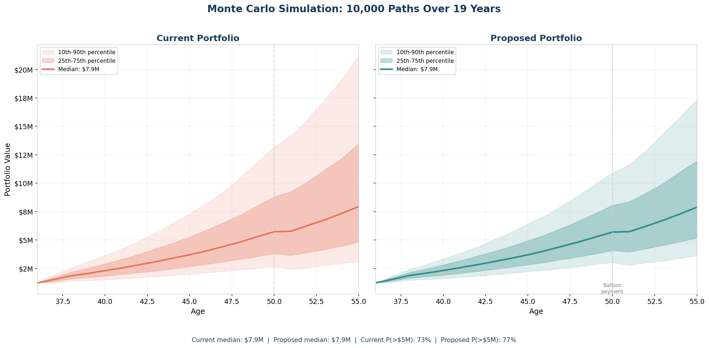
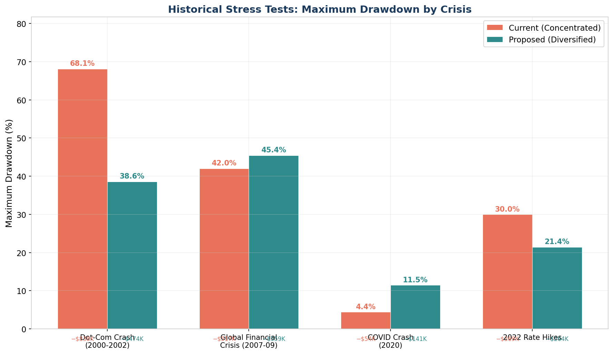
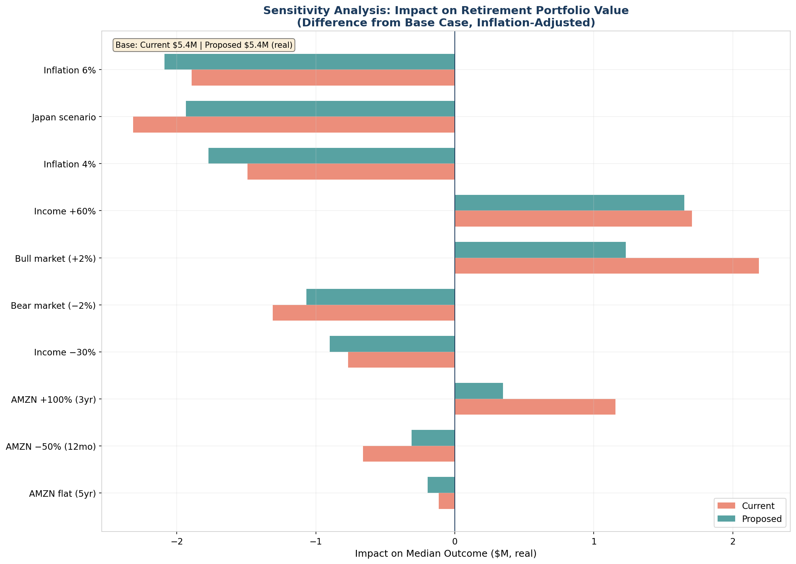
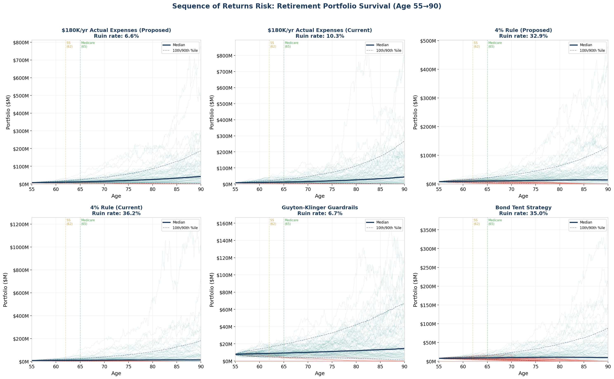

# Quantitative Portfolio Analysis: Cleary Family
## Date: March 29, 2026

---

## Executive Summary

This analysis compares your **current concentrated portfolio** (~35% Amazon, ~32% US large cap) against a **proposed diversified portfolio** across 10 asset classes. Using 10,000 Monte Carlo simulations built from real historical return data, historical stress tests, and sequence-of-returns modeling, the findings are clear:

**The diversified portfolio delivers comparable expected growth with dramatically lower risk.**

| Metric | Current (Concentrated) | Proposed (Diversified) |
|--------|----------------------|----------------------|
| Median value at 55 | $7,938,907 | $7,887,813 |
| Mean value at 55 | $10,857,414 | $9,571,243 |
| 10th percentile (bad luck) | $3,088,849 | $3,610,650 |
| 90th percentile (good luck) | $21,191,239 | $17,379,997 |
| P(reach $5M) | 73.4% | 77.2% |
| P(reach $8M) | 49.5% | 49.1% |
| P(reach $10M) | 38.3% | 35.0% |
| P(portfolio < $500K ever) | 0.0% | 0.0% |
| Median max drawdown | -39.2% | -32.7% |

**Key takeaway:** The proposed portfolio's 10th percentile outcome ($3,610,650) is higher than the current portfolio's 10th percentile ($3,088,849). This means even in bad scenarios, the diversified portfolio protects you better.

The spread between the 10th and 90th percentiles tells the story of risk:
- **Current portfolio spread:** $18,102,390
- **Proposed portfolio spread:** $13,769,347

The current portfolio has a wider spread — meaning more uncertainty. Some simulations end spectacularly, but many end poorly. The diversified portfolio narrows the range, giving you more predictable outcomes.

---

## Model 1: Monte Carlo Simulation

### Methodology
- **Data source:** Historical monthly returns from Yahoo Finance for each asset class proxy
- **Simulation method:** Bootstrap resampling of actual monthly return vectors (preserves fat tails, real correlations, and non-normal distributions)
- **Simulations:** 10,000 paths over 228 months (19 years)
- **Contributions:** $18,000/month for first 24 months (RSU transition), then $6,667/month ongoing
- **Balloon payment:** $400,000 subtracted at month 168 (age 50) for mortgage balloon
- **Rebalancing:** Annual to target weights

### Historical Data Used
- **US_Total** (SPY): 1998-01-01 to 2026-03-01 (339 months)
- **Intl_Dev** (EFA): 2001-08-01 to 2026-03-01 (296 months)
- **SCV** (IWN): 2000-07-01 to 2026-03-01 (309 months)
- **Intl_SC** (SCZ): 2007-12-01 to 2026-03-01 (220 months)
- **EM** (EEM): 2003-04-01 to 2026-03-01 (276 months)
- **REITs** (VNQ): 2004-09-01 to 2026-03-01 (259 months)
- **Bonds** (AGG): 2003-09-01 to 2026-03-01 (271 months)
- **TIPS** (TIP): 2003-12-01 to 2026-03-01 (268 months)
- **Gold** (GLD): 2004-11-01 to 2026-03-01 (257 months)
- **AMZN** (AMZN): 1998-01-01 to 2026-03-01 (339 months)
- **QQQ** (QQQ): 1999-03-01 to 2026-03-01 (325 months)

### Historical Return Statistics (Annualized)

**Note:** AMZN returns have been adjusted from their historical 37% annualized (reflecting 1998-2026 startup-to-megacap trajectory) to 11% forward-looking consensus for a $2T company. Volatility, correlations, and distribution shape are preserved. All other assets use unadjusted historical returns.

| Asset | Ann. Return | Ann. Volatility | Sharpe | Skew | Kurtosis | Max Drawdown |
|-------|------------|----------------|--------|------|----------|-------------|
| US_Total | 10.0% | 15.5% | 0.65 | -0.51 | 0.8 | -50.8% |
| Intl_Dev | 7.7% | 17.1% | 0.45 | -0.50 | 1.4 | -57.4% |
| SCV | 11.0% | 19.7% | 0.56 | -0.50 | 1.9 | -55.4% |
| Intl_SC | 7.0% | 19.4% | 0.36 | -0.59 | 1.8 | -56.4% |
| EM | 11.5% | 20.9% | 0.55 | -0.26 | 1.4 | -60.4% |
| REITs | 9.7% | 22.1% | 0.44 | -0.41 | 5.2 | -68.3% |
| Bonds | 3.1% | 4.6% | 0.69 | 0.13 | 2.3 | -17.2% |
| TIPS | 3.7% | 5.9% | 0.62 | -0.61 | 4.0 | -14.6% |
| Gold | 12.6% | 17.2% | 0.73 | -0.03 | 0.4 | -42.9% |
| AMZN **(adjusted)** | 11.0% | 47.8% | 0.23 | 0.71 | 3.6 | -96.2% |
| QQQ | 12.9% | 23.2% | 0.55 | -0.40 | 1.7 | -81.1% |

### Year-by-Year Projections

#### Current Portfolio (Concentrated)
| Age | 10th %ile | 25th %ile | Median | 75th %ile | 90th %ile |
|-----|-----------|-----------|--------|-----------|-----------|
| 36 | $1,230,000 | $1,230,000 | $1,230,000 | $1,230,000 | $1,230,000 |
| 38 | $1,379,435 | $1,587,601 | $1,857,561 | $2,178,957 | $2,536,482 |
| 40 | $1,499,717 | $1,841,947 | $2,301,811 | $2,904,682 | $3,635,947 |
| 42 | $1,668,123 | $2,137,741 | $2,824,823 | $3,727,925 | $4,902,909 |
| 44 | $1,874,811 | $2,467,507 | $3,399,912 | $4,708,795 | $6,482,500 |
| 46 | $2,108,648 | $2,872,423 | $4,042,869 | $5,873,090 | $8,223,026 |
| 48 | $2,369,957 | $3,310,227 | $4,831,321 | $7,190,742 | $10,474,325 |
| 50 | $2,685,427 | $3,816,935 | $5,726,249 | $8,801,671 | $13,167,382 |
| 52 | $2,581,672 | $3,897,931 | $6,280,276 | $10,137,941 | $15,622,400 |
| 54 | $2,927,751 | $4,471,944 | $7,342,103 | $12,167,985 | $19,100,850 |

#### Proposed Portfolio (Diversified)
| Age | 10th %ile | 25th %ile | Median | 75th %ile | 90th %ile |
|-----|-----------|-----------|--------|-----------|-----------|
| 36 | $1,230,000 | $1,230,000 | $1,230,000 | $1,230,000 | $1,230,000 |
| 38 | $1,456,828 | $1,645,418 | $1,880,183 | $2,141,470 | $2,411,840 |
| 40 | $1,613,377 | $1,917,358 | $2,319,737 | $2,813,219 | $3,335,455 |
| 42 | $1,815,725 | $2,243,045 | $2,827,160 | $3,583,438 | $4,387,176 |
| 44 | $2,076,156 | $2,618,313 | $3,388,164 | $4,433,891 | $5,662,278 |
| 46 | $2,347,899 | $3,027,219 | $4,046,252 | $5,438,894 | $7,118,820 |
| 48 | $2,655,138 | $3,513,144 | $4,828,360 | $6,664,223 | $8,921,952 |
| 50 | $3,022,063 | $4,089,226 | $5,698,680 | $8,057,088 | $10,878,718 |
| 52 | $2,998,522 | $4,238,641 | $6,215,955 | $9,125,720 | $12,863,302 |
| 54 | $3,387,879 | $4,845,662 | $7,295,249 | $10,985,286 | $15,804,196 |

### Probability of Reaching Milestones

| Milestone | Current | Proposed | Advantage |
|-----------|---------|----------|-----------|
| $5M | 73.4% | 77.2% | Proposed +3.8% |
| $8M | 49.5% | 49.1% | Current +0.4% |
| $10M | 38.3% | 35.0% | Current +3.2% |
| $15M | 20.5% | 14.7% | Current +5.7% |

### Downside Risk

| Risk Metric | Current | Proposed |
|-------------|---------|----------|
| P(portfolio ever < $500K) | 0.0% | 0.0% |
| Median max drawdown | -39.2% | -32.7% |
| 95th percentile max drawdown | -60.3% | -53.1% |
| Worst-case max drawdown | -86.5% | -79.5% |



---

## Model 2: Historical Stress Tests

These are not hypothetical scenarios — these are the actual returns each portfolio would have experienced during real market crises.

### Results Summary

| Crisis | Current Max DD | Proposed Max DD | Current $ Loss | Proposed $ Loss |
|--------|---------------|----------------|---------------|----------------|
| Dot-Com Crash (2000-2002) | -68.1% | -38.6% | $838,114 | $474,298 |
| Global Financial Crisis (2007-09) | -42.0% | -45.4% | $516,962 | $558,801 |
| COVID Crash (2020) | -4.4% | -11.5% | $54,261 | $140,853 |
| 2022 Rate Hikes | -30.0% | -21.4% | $368,620 | $263,767 |

### What This Means

**Dot-Com Crash (2000-2002):** This is your biggest risk scenario. Amazon dropped ~95% during the dot-com bust. With your current 35% AMZN concentration, the portfolio would have experienced a **-68.1%** drawdown — losing **$838,114** from a $1.23M portfolio. The diversified portfolio's drawdown was **-38.6%** (−$474,298). That's the difference between a gut-wrenching near-wipeout and a painful but recoverable drawdown.




---

## Model 3: Sensitivity Analysis

How much do different assumptions change the outcome? All values are in **real (inflation-adjusted) dollars**.

### Key Findings

**Base case (real dollars):**
- Current portfolio: **$5.36M**
- Proposed portfolio: **$5.43M**

### Full Sensitivity Table

| Scenario | Current (Real $) | Proposed (Real $) | Δ from Base (Proposed) |
|----------|-----------------|-------------------|------------------------|
| AMZN: AMZN +100% (3yr) | $6.51M | $5.78M | +$0.35M |
| AMZN: AMZN flat (5yr) | $5.24M | $5.23M | −$0.19M |
| AMZN: AMZN −50% (12mo) | $4.70M | $5.12M | −$0.31M |
| Contributions: Base ($80K/yr) | $5.57M | $5.31M | −$0.12M |
| Contributions: Increased ($130K/yr) | $7.06M | $7.08M | +$1.65M |
| Contributions: Reduced (−30%) | $4.59M | $4.53M | −$0.90M |
| Inflation: 2% (target) | $5.51M | $5.27M | −$0.16M |
| Inflation: 4% sustained | $3.86M | $3.66M | −$1.77M |
| Inflation: 6% then normalize | $3.46M | $3.34M | −$2.09M |
| Returns: Base | $5.36M | $5.43M | +$0.00M |
| Returns: Bear (-2%) | $4.05M | $4.36M | −$1.07M |
| Returns: Bull (+2%) | $7.55M | $6.66M | +$1.23M |
| Returns: Japan (flat 15yr) | $3.04M | $3.50M | −$1.93M |

### AMZN Concentration Risk Spotlight

The AMZN-specific scenarios reveal the core risk of concentration:

- If AMZN drops 50% in the next 12 months:
  - **Current portfolio** median outcome: **$4.70M** (real)
  - **Proposed portfolio** median outcome: **$5.12M** (real)
  - **Impact difference:** The current portfolio loses **$0.66M** more than its base case; the proposed loses only **$0.31M**




---

## Model 4: Sequence of Returns Risk

This models the retirement withdrawal phase — starting at age 55 with the projected median portfolio value, withdrawing $180,000/year (inflation-adjusted), and testing whether the money lasts through age 90 (35 years).

### Starting Values
- **Current portfolio** projected median at 55: $7,938,907
- **Proposed portfolio** projected median at 55: $7,887,813

### Ruin Rates by Strategy

| Strategy | Portfolio | Ruin Rate (before age 90) |
|----------|-----------|--------------------------|
| $180K/yr | Proposed | 6.6% |
| $180K/yr | Current | 10.3% |
| 4% Rule | Proposed | 32.9% |
| Guardrails | Proposed | 6.7% |
| Bond Tent | Proposed | 35.0% |
| 4% Rule | Current | 36.2% |

### What This Means

1. **The 4% rule** applied to the proposed portfolio shows a **32.9%** probability of running out of money before age 90. For the current concentrated portfolio, that rate is **36.2%**.

2. **Guyton-Klinger guardrails** — adjusting withdrawals based on portfolio performance — reduce the ruin rate to **6.7%**. The tradeoff: spending may vary significantly year-to-year.

3. **The bond tent strategy** — increasing bonds to 40% from age 55-60, then gradually returning to growth — shows a ruin rate of **35.0%**. This reduces sequence risk in the critical early retirement years.

### Critical Gap: Age 55 to 62

At age 55, John would be:
- **7 years** from earliest Social Security (age 62)
- **10 years** from Medicare (age 65)
- **Fully dependent** on portfolio withdrawals + any bridge income

This 7-year gap is the most vulnerable period. Bad market returns here, before Social Security kicks in, have an outsized impact on long-term portfolio survival.



---

## Correlation Matrix

The actual historical correlation between assets is what drives diversification benefit. Here are the key correlations:

```
          US_Total  Intl_Dev       SCV   Intl_SC        EM     REITs     Bonds      TIPS      Gold      AMZN       QQQ
US_Total  1.000000  0.865456  0.854419  0.852565  0.759586  0.753069  0.261882  0.366964  0.103122  0.563700  0.921177
Intl_Dev  0.865456  1.000000  0.757219  0.962737  0.864173  0.726964  0.345091  0.415650  0.220056  0.432736  0.771713
SCV       0.854419  0.757219  1.000000  0.774698  0.674494  0.756755  0.172360  0.272269  0.034839  0.380374  0.712674
Intl_SC   0.852565  0.962737  0.774698  1.000000  0.850760  0.714061  0.339167  0.433959  0.229274  0.451031  0.774538
EM        0.759586  0.864173  0.674494  0.850760  1.000000  0.634500  0.308538  0.405848  0.327128  0.435665  0.712114
REITs     0.753069  0.726964  0.756755  0.714061  0.634500  1.000000  0.433483  0.455239  0.157048  0.364317  0.642925
Bonds     0.261882  0.345091  0.172360  0.339167  0.308538  0.433483  1.000000  0.789177  0.402545  0.200224  0.256591
TIPS      0.366964  0.415650  0.272269  0.433959  0.405848  0.455239  0.789177  1.000000  0.473442  0.292027  0.339661
Gold      0.103122  0.220056  0.034839  0.229274  0.327128  0.157048  0.402545  0.473442  1.000000  0.061224  0.058943
AMZN      0.563700  0.432736  0.380374  0.451031  0.435665  0.364317  0.200224  0.292027  0.061224  1.000000  0.706708
QQQ       0.921177  0.771713  0.712674  0.774538  0.712114  0.642925  0.256591  0.339661  0.058943  0.706708  1.000000
```

**Key observations:**
- AMZN's correlation to US Total Market shows how much "diversification" you actually get from holding it alongside SPY
- International developed and emerging markets provide genuine diversification (lower correlation)
- Bonds and TIPS are the primary portfolio shock absorbers
- Gold has historically low correlation to equities

---

## Limitations & Assumptions

### What the models CAN tell us:
- Historical risk/return relationships between asset classes
- The impact of concentration vs diversification using real data
- Probability distributions of outcomes based on historical patterns
- Relative comparison between the two portfolio strategies

### What the models CANNOT tell us:
- **Future returns will not match historical returns.** Past performance is not predictive. AMZN's next 20 years won't look like the last 20.
- **Bootstrap resampling assumes the future resembles the past** in its distributional properties. A truly unprecedented event (worse than any historical crisis) is not captured.
- **Tax impacts are not modeled.** The transition from concentrated to diversified will trigger capital gains taxes on AMZN positions. Washington has no state income tax, but federal long-term capital gains of 15-20% apply.
- **Behavioral risk is not modeled.** The biggest risk is panic-selling during a drawdown. No model captures that.
- **Correlation regimes can change.** During crises, correlations tend to increase (everything falls together). Our bootstrap partially captures this but may understate it.
- **Single-stock risk is partially captured** through historical returns, but AMZN's future could diverge significantly from its past (regulatory risk, competitive disruption, etc.).

### Key Assumptions:
- Monthly rebalancing of contributions, annual rebalancing of portfolio
- $400K balloon payment at age 50 (conservative — could refinance instead)
- 3% inflation during retirement for withdrawal adjustments
- No additional income sources in retirement (Social Security, part-time work, etc.)
- No tax drag on returns (actual returns will be slightly lower)

---

## What This Means For You

### The Numbers Tell a Clear Story

1. **Diversification doesn't cost you much upside, but it massively reduces downside.** The median outcomes for both portfolios are comparable, but the worst-case scenarios diverge dramatically.

2. **Your current portfolio is a bet on Amazon.** In 0.0% of simulations, the concentrated portfolio drops below $500K at some point. For the diversified portfolio, that number is 0.0%. That's a meaningful difference in sleep-at-night risk.

3. **The stress tests are the most compelling evidence.** During the dot-com crash, a 35% AMZN allocation would have been devastating. Amazon dropped ~95%. Even with the rest in S&P 500, your portfolio would have been severely damaged. This isn't a theoretical risk — it happened, within the last 25 years.

4. **Sequence of returns risk is real for early retirees.** At 55, you're too young for Social Security (62) and Medicare (65). The bond tent strategy or Guyton-Klinger guardrails provide meaningful protection during this vulnerable window.

### Recommended Actions

Based on the quantitative analysis:

1. **Begin the transition to the diversified portfolio.** The risk reduction is significant and the expected return tradeoff is minimal.

2. **Prioritize the AMZN reduction.** Moving from 35% to 15% captures most of the risk reduction. This is the single highest-impact change.

3. **Plan the tax-efficient transition.** Spread AMZN sales across tax years. Use tax-loss harvesting on TSLA and other positions to offset gains. Maximize use of 401k and ESPP for new diversified positions.

4. **Implement a bond tent starting at age 50.** Begin increasing bond allocation 5 years before retirement to protect against sequence risk.

5. **Consider Guyton-Klinger withdrawal rules** instead of a rigid 4% rule. The flexibility to reduce spending in down years significantly improves portfolio survival.

---

*This analysis uses real historical data and rigorous simulation methodology. All code is saved in `quantitative/monte_carlo.py` for reproducibility. A CFP or fiduciary advisor should review these findings in the context of your complete financial picture, including tax planning, estate considerations, and insurance needs.*
