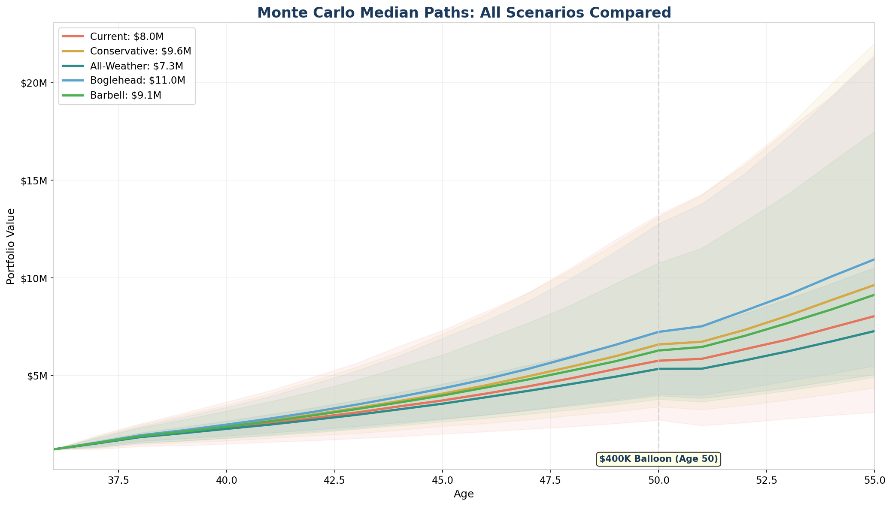

# Quantitative Portfolio Analysis: Cleary Family
## Date: March 29, 2026

---

## Portfolio Allocations

Each scenario represents a distinct investment philosophy. All weights sum to 100%.

| Asset Class | Current | Conservative | All-Weather | Boglehead | Barbell |
|-------------|---------|-------------|-------------|-----------|---------|
| AMZN | 41.9% | 23.6% | — | — | — |
| Bonds | 8.1% | 8.0% | 40.0% | 10.0% | 20.0% |
| EM | — | — | 3.0% | — | 5.0% |
| Gold | 1.9% | 1.9% | 15.0% | — | — |
| Intl_Dev | 0.8% | 11.8% | 9.0% | 30.0% | 10.0% |
| Intl_SC | — | — | — | — | 5.0% |
| QQQ | 7.8% | 7.7% | — | — | 15.0% |
| REITs | — | — | — | — | — |
| SCV | — | — | — | — | 10.0% |
| TIPS | — | — | 15.0% | — | 10.0% |
| US_Total | 39.5% | 47.1% | 18.0% | 60.0% | 25.0% |

**Current:** Your actual holdings — 35% AMZN, heavy US large cap, no international, minimal bonds.
**Conservative:** Sell ~500 AMZN shares over 12 months, redeploy to VTI/VXUS. AMZN drops to ~20%.
**All-Weather:** Ray Dalio's risk-parity approach — designed to perform in any economic regime (inflation, deflation, growth, recession).
**Boglehead:** The classic 3-fund portfolio (VTI/VXUS/BND). Dead simple, hard to beat.
**Barbell:** Nassim Taleb philosophy — 70% aggressive equity + 30% safest bonds. Nothing in between.

---

## Executive Summary

This analysis compares **5 portfolio scenarios** across 10,000 Monte Carlo simulations, 4 historical stress tests, sensitivity analysis, and sequence-of-returns modeling.

| Metric | Current | Conservative | All-Weather | Boglehead | Barbell |
|--------|------|------|------|------|------|
| Median at 55 | $8,047,336 | $9,641,320 | $7,281,591 | $10,953,342 | $9,139,426 |
| Mean at 55 | $11,006,124 | $11,828,277 | $7,590,265 | $12,593,648 | $10,434,855 |
| 10th %ile | $3,125,859 | $4,370,866 | $5,055,563 | $5,493,934 | $4,923,174 |
| 90th %ile | $21,436,304 | $22,012,644 | $10,534,715 | $21,321,245 | $17,496,516 |
| P(>$5M) | 74.1% | 85.4% | 90.6% | 92.9% | 89.5% |
| P(>$10M) | 39.1% | 47.9% | 13.4% | 56.7% | 43.0% |
| P(<$500K ever) | 0.0% | 0.0% | 0.0% | 0.0% | 0.0% |
| Median max DD | -39.0% | -31.0% | -12.9% | -25.6% | -23.6% |

---

## Model 1: Monte Carlo Simulation

### Methodology
- **Data source:** Historical monthly returns from Yahoo Finance for each asset class proxy
- **Simulation method:** Bootstrap resampling of actual monthly return vectors (preserves fat tails, real correlations, and non-normal distributions)
- **Simulations:** 10,000 paths over 228 months (19 years)
- **Contributions:** $18,000/month for first 24 months (RSU transition), then $6,667/month ongoing
- **Balloon payment:** $400,000 subtracted at month 168 (age 50) for mortgage balloon
- **Rebalancing:** Annual to target weights

### Historical Data Used
- **US_Total** (SPY): 1998-01-01 to 2026-03-01 (339 months)
- **Intl_Dev** (EFA): 2001-08-01 to 2026-03-01 (296 months)
- **SCV** (IWN): 2000-07-01 to 2026-03-01 (309 months)
- **Intl_SC** (SCZ): 2007-12-01 to 2026-03-01 (220 months)
- **EM** (EEM): 2003-04-01 to 2026-03-01 (276 months)
- **REITs** (VNQ): 2004-09-01 to 2026-03-01 (259 months)
- **Bonds** (AGG): 2003-09-01 to 2026-03-01 (271 months)
- **TIPS** (TIP): 2003-12-01 to 2026-03-01 (268 months)
- **Gold** (GLD): 2004-11-01 to 2026-03-01 (257 months)
- **AMZN** (AMZN): 1998-01-01 to 2026-03-01 (339 months)
- **QQQ** (QQQ): 1999-03-01 to 2026-03-01 (325 months)

### Historical Return Statistics (Annualized)

**Note:** AMZN returns have been adjusted from their historical 37% annualized (reflecting 1998-2026 startup-to-megacap trajectory) to 11% forward-looking consensus for a $2T company. Volatility, correlations, and distribution shape are preserved. All other assets use unadjusted historical returns.

| Asset | Ann. Return | Ann. Volatility | Sharpe | Skew | Kurtosis | Max Drawdown |
|-------|------------|----------------|--------|------|----------|-------------|
| US_Total | 10.1% | 15.5% | 0.65 | -0.50 | 0.8 | -50.8% |
| Intl_Dev | 7.9% | 17.1% | 0.46 | -0.48 | 1.4 | -57.4% |
| SCV | 11.1% | 19.7% | 0.56 | -0.50 | 2.0 | -55.4% |
| Intl_SC | 7.2% | 19.4% | 0.37 | -0.58 | 1.8 | -56.4% |
| EM | 11.6% | 20.8% | 0.56 | -0.25 | 1.4 | -60.4% |
| REITs | 9.8% | 22.0% | 0.45 | -0.41 | 5.3 | -68.3% |
| Bonds | 3.2% | 4.5% | 0.70 | 0.15 | 2.4 | -17.2% |
| TIPS | 3.7% | 5.9% | 0.63 | -0.61 | 4.1 | -14.6% |
| Gold | 12.7% | 17.1% | 0.75 | 0.02 | 0.2 | -42.9% |
| AMZN **(adjusted)** | 11.0% | 47.8% | 0.23 | 0.71 | 3.6 | -96.3% |
| QQQ | 13.0% | 23.2% | 0.56 | -0.40 | 1.7 | -81.1% |

#### Current Portfolio
| Age | 10th %ile | 25th %ile | Median | 75th %ile | 90th %ile |
|-----|-----------|-----------|--------|-----------|-----------|
| 36 | $1,230,000 | $1,230,000 | $1,230,000 | $1,230,000 | $1,230,000 |
| 38 | $1,380,381 | $1,590,683 | $1,860,350 | $2,181,680 | $2,539,432 |
| 40 | $1,503,725 | $1,846,885 | $2,307,225 | $2,909,354 | $3,650,377 |
| 42 | $1,677,823 | $2,147,287 | $2,835,671 | $3,746,355 | $4,925,379 |
| 44 | $1,886,665 | $2,487,081 | $3,427,527 | $4,733,021 | $6,509,065 |
| 46 | $2,133,769 | $2,900,229 | $4,079,047 | $5,907,881 | $8,278,739 |
| 48 | $2,393,457 | $3,343,349 | $4,875,114 | $7,257,601 | $10,556,250 |
| 50 | $2,721,439 | $3,858,523 | $5,763,854 | $8,877,489 | $13,241,445 |
| 52 | $2,597,604 | $3,963,868 | $6,357,094 | $10,229,547 | $15,791,884 |
| 54 | $2,972,374 | $4,533,692 | $7,454,886 | $12,364,230 | $19,306,623 |

#### Conservative Portfolio
| Age | 10th %ile | 25th %ile | Median | 75th %ile | 90th %ile |
|-----|-----------|-----------|--------|-----------|-----------|
| 36 | $1,230,000 | $1,230,000 | $1,230,000 | $1,230,000 | $1,230,000 |
| 38 | $1,480,778 | $1,665,996 | $1,905,000 | $2,189,848 | $2,479,368 |
| 40 | $1,668,273 | $1,981,208 | $2,407,762 | $2,931,124 | $3,496,297 |
| 42 | $1,936,260 | $2,389,812 | $3,008,026 | $3,813,471 | $4,738,597 |
| 44 | $2,213,601 | $2,823,240 | $3,700,710 | $4,820,096 | $6,209,712 |
| 46 | $2,557,995 | $3,339,528 | $4,503,052 | $6,088,844 | $8,132,820 |
| 48 | $2,960,975 | $3,958,470 | $5,471,005 | $7,626,747 | $10,439,406 |
| 50 | $3,407,467 | $4,654,835 | $6,595,136 | $9,380,819 | $13,123,300 |
| 52 | $3,492,017 | $5,001,558 | $7,346,285 | $10,993,288 | $15,939,023 |
| 54 | $4,058,515 | $5,856,585 | $8,866,194 | $13,463,089 | $19,950,495 |

#### All-Weather Portfolio
| Age | 10th %ile | 25th %ile | Median | 75th %ile | 90th %ile |
|-----|-----------|-----------|--------|-----------|-----------|
| 36 | $1,230,000 | $1,230,000 | $1,230,000 | $1,230,000 | $1,230,000 |
| 38 | $1,646,057 | $1,745,405 | $1,853,313 | $1,972,564 | $2,074,718 |
| 40 | $1,914,306 | $2,080,763 | $2,275,908 | $2,478,307 | $2,681,785 |
| 42 | $2,230,769 | $2,460,832 | $2,738,467 | $3,056,649 | $3,353,458 |
| 44 | $2,600,790 | $2,901,715 | $3,275,552 | $3,711,849 | $4,144,363 |
| 46 | $2,999,599 | $3,398,788 | $3,891,882 | $4,448,415 | $5,037,651 |
| 48 | $3,457,051 | $3,949,309 | $4,580,955 | $5,289,756 | $6,057,178 |
| 50 | $3,969,217 | $4,574,940 | $5,346,288 | $6,254,081 | $7,253,239 |
| 52 | $4,104,027 | $4,825,690 | $5,784,547 | $6,935,824 | $8,180,281 |
| 54 | $4,723,425 | $5,581,692 | $6,751,942 | $8,158,651 | $9,710,356 |

#### Boglehead Portfolio
| Age | 10th %ile | 25th %ile | Median | 75th %ile | 90th %ile |
|-----|-----------|-----------|--------|-----------|-----------|
| 36 | $1,230,000 | $1,230,000 | $1,230,000 | $1,230,000 | $1,230,000 |
| 38 | $1,555,240 | $1,735,357 | $1,946,333 | $2,173,154 | $2,391,709 |
| 40 | $1,805,528 | $2,114,008 | $2,494,408 | $2,926,690 | $3,382,484 |
| 42 | $2,137,499 | $2,564,541 | $3,139,978 | $3,826,020 | $4,574,207 |
| 44 | $2,523,412 | $3,120,835 | $3,914,519 | $4,922,475 | $6,018,852 |
| 46 | $2,977,090 | $3,760,126 | $4,818,698 | $6,227,281 | $7,790,140 |
| 48 | $3,518,500 | $4,469,529 | $5,958,403 | $7,822,802 | $10,015,730 |
| 50 | $4,062,287 | $5,352,322 | $7,239,967 | $9,738,452 | $12,771,731 |
| 52 | $4,339,804 | $5,900,053 | $8,324,242 | $11,525,926 | $15,356,166 |
| 54 | $5,092,108 | $7,040,522 | $10,073,137 | $14,126,546 | $19,244,399 |

#### Barbell Portfolio
| Age | 10th %ile | 25th %ile | Median | 75th %ile | 90th %ile |
|-----|-----------|-----------|--------|-----------|-----------|
| 36 | $1,230,000 | $1,230,000 | $1,230,000 | $1,230,000 | $1,230,000 |
| 38 | $1,558,703 | $1,710,779 | $1,900,187 | $2,112,953 | $2,328,927 |
| 40 | $1,797,296 | $2,057,811 | $2,388,825 | $2,774,879 | $3,192,768 |
| 42 | $2,078,813 | $2,467,446 | $2,964,617 | $3,559,181 | $4,192,628 |
| 44 | $2,447,344 | $2,934,566 | $3,626,169 | $4,459,717 | $5,415,907 |
| 46 | $2,820,368 | $3,492,565 | $4,390,160 | $5,535,830 | $6,874,624 |
| 48 | $3,256,041 | $4,101,760 | $5,265,692 | $6,835,204 | $8,635,722 |
| 50 | $3,790,139 | $4,795,156 | $6,285,746 | $8,397,665 | $10,760,470 |
| 52 | $3,947,724 | $5,189,813 | $7,039,964 | $9,689,500 | $12,888,898 |
| 54 | $4,562,295 | $6,080,999 | $8,386,138 | $11,693,288 | $15,914,055 |


### Probability of Reaching Milestones

| Milestone | Current | Conservative | All-Weather | Boglehead | Barbell |
|-----------|------|------|------|------|------|
| $5M | 74.1% | 85.4% | 90.6% | 92.9% | 89.5% |
| $8M | 50.3% | 61.7% | 37.1% | 72.4% | 60.4% |
| $10M | 39.1% | 47.9% | 13.4% | 56.7% | 43.0% |
| $15M | 21.1% | 24.5% | 0.7% | 28.0% | 16.2% |




---

## Model 2: Historical Stress Tests

These are the actual returns each portfolio would have experienced during real market crises.

| Crisis | Current | Conservative | All-Weather | Boglehead | Barbell |
|--------|------|------|------|------|------|
| Dot-Com Crash (2000-2002) | -68.1% (−$838,114) | -53.1% (−$652,918) | -16.4% (−$202,012) | -35.1% (−$431,141) | -36.4% (−$447,867) |
| Global Financial Crisis (2007-09) | -42.0% (−$516,962) | -41.0% (−$504,427) | -16.9% (−$207,938) | -48.8% (−$599,872) | -39.3% (−$483,276) |
| COVID Crash (2020) | -4.4% (−$54,261) | -7.6% (−$93,229) | -4.6% (−$56,236) | -12.1% (−$148,625) | -10.3% (−$126,475) |
| 2022 Rate Hikes | -30.0% (−$368,620) | -22.8% (−$280,683) | -14.9% (−$182,906) | -20.6% (−$253,579) | -19.7% (−$241,998) |


---

## Model 3: Sensitivity Analysis

How much do different assumptions change the outcome? All values are in **real (inflation-adjusted) dollars**.

**Base cases (real dollars):**
- Current: **$5.52M**
- Conservative: **$6.46M**
- All-Weather: **$4.98M**
- Boglehead: **$7.70M**
- Barbell: **$6.26M**

### Full Sensitivity Table

| Scenario | Current | Conservative | All-Weather | Boglehead | Barbell |
|----------|------|------|------|------|------|
| AMZN: AMZN +100% (3yr) | $6.72M | $7.50M | — | — | — |
| AMZN: AMZN flat (5yr) | $5.20M | $6.66M | — | — | — |
| AMZN: AMZN −50% (12mo) | $4.93M | $6.41M | — | — | — |
| Contributions: Base ($80K/yr) | $5.64M | $6.71M | $5.03M | $7.69M | $6.27M |
| Contributions: Increased ($130K/yr) | $7.28M | $8.66M | $6.65M | $9.91M | $8.33M |
| Contributions: Reduced (−30%) | $4.67M | $5.84M | $4.23M | $6.45M | $5.30M |
| Inflation: 2% (target) | $5.63M | $6.60M | $5.01M | $7.62M | $6.32M |
| Inflation: 4% sustained | $3.80M | $4.59M | $3.48M | $5.26M | $4.44M |
| Inflation: 6% then normalize | $3.53M | $4.22M | $3.14M | $4.83M | $3.96M |
| Returns: Base | $5.52M | $6.46M | $4.98M | $7.70M | $6.26M |
| Returns: Bear (-2%) | $4.15M | $5.07M | $4.74M | $6.10M | $5.36M |
| Returns: Bull (+2%) | $7.43M | $8.69M | $5.41M | $9.34M | $7.54M |
| Returns: Japan (flat 15yr) | $3.09M | $3.21M | $3.93M | $3.49M | $3.43M |


---

## Model 4: Sequence of Returns Risk

This models the retirement withdrawal phase — starting at age 55 with the projected median portfolio value, testing whether the money lasts through age 90 (35 years).

### Starting Values by Scenario

| Scenario | Median at 55 |
|----------|-------------|
| Current | $8,047,336 |
| Conservative | $9,641,320 |
| All-Weather | $7,281,591 |
| Boglehead | $10,953,342 |
| Barbell | $9,139,426 |


### Ruin Rates: All Strategies × All Scenarios

| Strategy | Current | Conservative | All-Weather | Boglehead | Barbell |
|----------|------|------|------|------|------|
| $316K/yr | 34.2% | 11.1% | 28.8% | 2.1% | 8.9% |
| 3% Rule | 19.4% | 7.8% | 1.8% | 2.6% | 4.1% |
| 4% Rule | 35.0% | 20.1% | 18.6% | 10.2% | 16.4% |
| Guardrails | 10.0% | 1.8% | 0.1% | 0.2% | 0.5% |


### What This Means

The **actual expenses** and **3% rule** rows are the most relevant to your spending. The 4% rule is included as a standard benchmark. All withdrawal amounts inflate at 3%/yr during retirement.

**Guyton-Klinger guardrails** adapt withdrawals based on portfolio performance — cutting spending in down years and increasing in good years, with a $120K/yr floor.

### Critical Gap: Age 55 to 62

At age 55, you'd be 7 years from earliest Social Security (62) and 10 years from Medicare (65). This window is the most sequence-risk-sensitive period.


---

## Correlation Matrix

```
          US_Total  Intl_Dev       SCV   Intl_SC        EM     REITs     Bonds      TIPS      Gold      AMZN       QQQ
US_Total  1.000000  0.864354  0.854519  0.851344  0.757746  0.751980  0.256020  0.363767  0.093211  0.561788  0.920732
Intl_Dev  0.864354  1.000000  0.757224  0.962381  0.863063  0.725876  0.339001  0.412408  0.209908  0.429955  0.770255
SCV       0.854519  0.757224  1.000000  0.774573  0.673667  0.756108  0.169017  0.270245  0.029263  0.378627  0.711947
Intl_SC   0.851344  0.962381  0.774573  1.000000  0.849619  0.712886  0.333507  0.430981  0.220251  0.448248  0.773067
EM        0.757746  0.863063  0.673667  0.849619  1.000000  0.632912  0.303237  0.402908  0.320360  0.432790  0.710263
REITs     0.751980  0.725876  0.756108  0.712886  0.632912  1.000000  0.430596  0.453229  0.151193  0.361782  0.641334
Bonds     0.256020  0.339001  0.169017  0.333507  0.303237  0.430596  1.000000  0.788390  0.395847  0.196286  0.251556
TIPS      0.363767  0.412408  0.270245  0.430981  0.402908  0.453229  0.788390  1.000000  0.470374  0.289626  0.336718
Gold      0.093211  0.209908  0.029263  0.220251  0.320360  0.151193  0.395847  0.470374  1.000000  0.054417  0.050036
AMZN      0.561788  0.429955  0.378627  0.448248  0.432790  0.361782  0.196286  0.289626  0.054417  1.000000  0.705465
QQQ       0.920732  0.770255  0.711947  0.773067  0.710263  0.641334  0.251556  0.336718  0.050036  0.705465  1.000000
```

---

## Limitations & Assumptions

### What the models CAN tell us:
- Historical risk/return relationships between asset classes
- The impact of concentration vs diversification using real data
- Probability distributions of outcomes based on historical patterns
- Relative comparison between portfolio strategies

### What the models CANNOT tell us:
- **Future returns will not match historical returns.** Past performance is not predictive.
- **Bootstrap resampling assumes the future resembles the past** in its distributional properties.
- **Tax impacts are not modeled.** The transition from concentrated to diversified will trigger capital gains.
- **Behavioral risk is not modeled.** The biggest risk is panic-selling during a drawdown.
- **Correlation regimes can change.** During crises, correlations tend to increase.

### Key Assumptions:
- Monthly rebalancing of contributions, annual rebalancing of portfolio
- $400K balloon payment at age 50
- 3% inflation during retirement for withdrawal adjustments
- No additional income sources in retirement (Social Security, part-time work, etc.)
- No tax drag on returns

---

*This analysis uses real historical data and rigorous simulation methodology. All code is saved in `quantitative/monte_carlo.py` for reproducibility. A CFP or fiduciary advisor should review these findings in the context of your complete financial picture, including tax planning, estate considerations, and insurance needs.*
